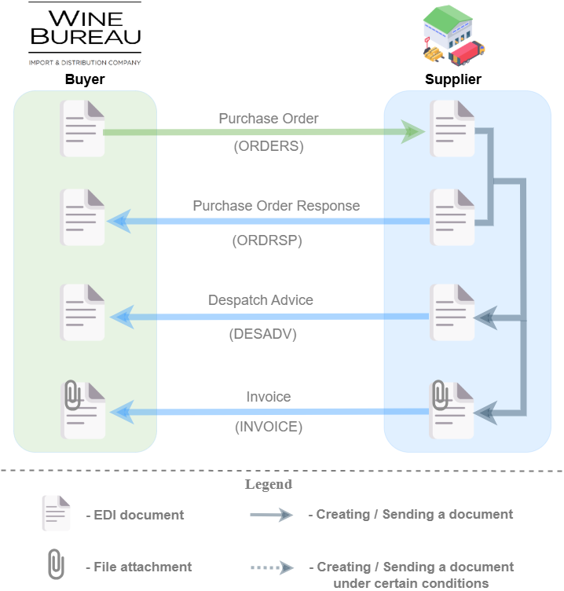

#############################################################################################################################################################
Document flow with the "Wine Bureau" Import and Distribution Company on the EDI Network 2.0 platform: "International deliveries". Instructions for Supplier
#############################################################################################################################################################

.. сюда закину немного картинок для текста

.. |лупа| image:: pics_WB_International_deliveries_instruction/WB_International_deliveries_instruction_003.png

.. |будинок| image:: pics_WB_International_deliveries_instruction/WB_International_deliveries_instruction_004.png

.. |прокрутка1| image:: /retail_2.0/pics_formuvannia_Condra/formuvannia_Condra_026.png

.. |прокрутка2| image:: /retail_2.0/pics_formuvannia_Condra/formuvannia_Condra_027.png

.. |trash| image:: /retail_2.0/pics_formuvannia_Condra/formuvannia_Condra_025.png

.. role:: red

.. contents:: Contents:
   :depth: 2

--------------

Introduction
====================================

This instruction describes the document flow procedure with "Wine Bureau" Import and Distribution Company on the EDI Network 2.0 platform according to the scheme provided for international deliveries. Document flow is organized by the following documents:

- `Purchase Order <https://wiki.edin.ua/en/latest/XML/XML-structure.html#purchase-order-document-order>`__
- `Purchase Order Response <https://wiki.edin.ua/en/latest/XML/XML-structure.html#purchase-order-response-document-ordrsp>`__
- `Despatch Advice <https://wiki.edin.ua/en/latest/XML/XML-structure.html#despatch-advice-document-desadv>`__
- `Invoice <https://wiki-v2.edin.ua/books/xml-specifikaciyi-dokumentiv/page/raxunok-invoice>`__

**General document flow scheme:**

.. початок блоку для Universal_International_deliveries

1 Login to the platform
====================================

.. include:: /general_2_0/rabota_s_platformoj_EDIN_2.0.rst
   :start-after: .. початок блоку для Enter
   :end-before: .. кінець блоку для Enter

After successful authorization, the main menu will be opened, where You need to select the **"EDI Network"** service in the **"Services"** EDIN tab:

.. image:: /_constant/pics_landing/landing_edi.png
   :align: center

2 Formation of "Purchase Order Response" (ORDRSP) based on incoming "Purchase Order" (ORDER)
==============================================================================================================

Distribution Company is the initiator of the document flow and sends the "Purchase Order" (ORDER). Supplier receives an email notification about that. 

.. image:: /ClientProcesses/WineBureau/WB_Instructions/pics_WB_International_deliveries_instruction/WB_International_deliveries_instruction_006.png
   :align: center

To form a "Purchase Order Response" (ORDRSP), you should open the incoming "Purchase Order" (ORDER). Use one of the following ways to do that:

**Way #1** - opening "Purchase Order" from the incoming email notification. Click on the "View document" button in the email (see the screen above). You should be authorized to watch the ORDER.

**Way #2** - opening "Purchase Order" on the web platform. Choose "Purchase Order" (ORDER) in the **"Inbox"** folder (use `search <https://wiki.edin.ua/uk/latest/general_2_0/rabota_s_platformoj_EDIN_2.0.html#doc-search>`__ for convenience):

.. image:: /ClientProcesses/WineBureau/WB_Instructions/pics_WB_International_deliveries_instruction/WB_International_deliveries_instruction_007.png
   :align: center

"Purchase Order" (ORDER) form will be opened after using onе of the ways above. If you need to download the "Purchase Order Response", click **"Download"** button as it is shown on the screen below. And choose one of the file types in the dropdown. The Order file of the chosen type will be downloaded to your computer.

.. image:: /ClientProcesses/WineBureau/WB_Instructions/pics_WB_International_deliveries_instruction/WB_International_deliveries_instruction_010.png
   :align: center

To create a "Purchase Order Response" (ORDRSP) click **"Create document"** button in the block `document chain <https://wiki.edin.ua/uk/latest/_constant/chain/chain.html>`__ :

.. image:: /ClientProcesses/WineBureau/WB_Instructions/pics_WB_International_deliveries_instruction/WB_International_deliveries_instruction_008.png
   :align: center

In the opened "Purchase Order Response" (ORDRSP) form, some fields are filled automatically from the related "Purchase Order" (mandatory fields are marked with a red asterisk :red:`*`):

.. image:: /ClientProcesses/WineBureau/WB_Instructions/pics_WB_International_deliveries_instruction/WB_International_deliveries_instruction_009.png
   :align: center

- **Sender** / **Recipient** data are filled in automatically from the base document and the selected company and cannot be edited. 
- Document subtype **Purchase Order Response** (*Purchase Order Response*, *Purchase Order Response Replacement*, *Deleting a Purchase Order Response*), **Number**, **Date** / time of the document are filled automatically, but available for editing if necessary. 
- **Buyer**, **Supplier**, **Shipping Address** data are also filled in automatically - they can be edited using the "Search counterparty" buttons (|лупа|) or "Point yourself" (|будинок|) (for more details see `here <https://wiki.edin.ua/en/latest/ClientProcesses/WineBureau/WB_Instructions/WB_International_deliveries_instruction.html#search-counterparty-in-a-document>`__).

In the same way, it is possible to add (optionally) information about **Final recipient**, **Payer**, **Shipments point**, **Consignee**. Data from "Purchase Order" is transferred automatically and cannot be edited.

The order currency is set automatically from "Purchase Order" (UAH / EUR / USD).

The **Additional Information** and **Ramps** blocks are optional and collapsed by default. Block **Total** is calculated automatically after filling table positions in.

The tabular part displays basic information on the ordered **goods items**. **Items** are taken from "Purchase Order" and "Will be delivered" by default. By default, **Ordered quantity** is equal to **Confirmed quantity** for each item. It is possible to adjust the value of **Confirmed quantity** of the product directly in the table (with adjustments at the same time the item automatically will receive "Quantity change" action):

.. image:: /ClientProcesses/ATB/ATB_Instructions/pics_ATB_International_deliveries_instruction/ATB_International_deliveries_instruction_057.png
   :align: center

The Supplier can edit "Confirmed quantity" and "Price without VAT" directly in the table or **"Change"** item data in the advanced form "Position info" after clicking on the barcode of the item:

.. image:: /ClientProcesses/ATB/ATB_Instructions/pics_ATB_International_deliveries_instruction/ATB_International_deliveries_instruction_068.png
   :align: center

It is also possible to choose (mark with a checker) the items for which you need to change the delivery status to **Will be delivered** (**Confirmed quantity** = **Ordered quantity**) or **Denied** (**Confirmed quantity** =0) using the **"Actions on selected"** button:

.. image:: /ClientProcesses/ATB/ATB_Instructions/pics_ATB_International_deliveries_instruction/ATB_International_deliveries_instruction_058.png
   :align: center

:red:`All changes in positions must be made only after coordination with the Distribution company!`

If there is no delivery for some of the items, they should be marked with a check mark and **"Delete"**. It is also possible to **"+Add"** new product positions, but these actions should be coordinated with the Distribution company.

.. image:: /ClientProcesses/ATB/ATB_Instructions/pics_ATB_International_deliveries_instruction/ATB_International_deliveries_instruction_069.png
   :align: center

After entering all the data in the document, click the button **"Save"** (1), then **"Send"** (2):

.. image:: /ClientProcesses/ATB/ATB_Instructions/pics_ATB_International_deliveries_instruction/ATB_International_deliveries_instruction_059.png
   :align: center

The sent document will be automatically placed into the **"Outbox"** folder and will be in the `document chain <https://wiki.edin.ua/uk/latest/_constant/chain/chain.html>`__ documents together with "Purchase Order":

.. image:: /ClientProcesses/ATB/ATB_Instructions/pics_ATB_International_deliveries_instruction/ATB_International_deliveries_instruction_060.png
   :align: center

3 Formation of "Despatch Advice" (DESADV)
=========================================================================================================================

The formation of the "Despatch Advice" (DESADV) document on the EDI Network platform can be carried out on the basis of "Purchase Order" (ORDER) as well as on the basis of "Purchase Order Response" (ORDRSP).

Let's consider the formation of the "Despatch Advice" (DESADV) document on the basis of "Purchase Order Response" (ORDRSP).

For that, you need to select "Purchase Order Response" (ORDRSP) (for which you need to make a shipment) in the **"Outbox"** folder (for convenience you can use `search <https://wiki.edin.ua/uk/latest/general_2_0/rabota_s_platformoj_EDIN_2.0.html#doc-search>`__): 

.. image:: /ClientProcesses/WineBureau/WB_Instructions/pics_WB_International_deliveries_instruction/WB_International_deliveries_instruction_061.png
   :align: center

Open the sent "Purchase Order Response" (ORDRSP) with the left mouse button and create a "Despatch Advice" (DESADV) for Distribution company using the **"Create document"** button in the `document chain <https://wiki.edin.ua/uk/latest/_constant/chain/chain.html>`__ block:

.. image:: /ClientProcesses/WineBureau/WB_Instructions/pics_WB_International_deliveries_instruction/WB_International_deliveries_instruction_062.png
   :align: center

In the opened "Despatch Advice" (DESADV) form, almost all fields are filled in automatically from the associated basic document (mandatory fields are marked with a red asterisk :red:`*`):

.. image:: /ClientProcesses/WineBureau/WB_Instructions/pics_WB_International_deliveries_instruction/WB_International_deliveries_instruction_063.png
   :align: center

- **Sender** data is automatically filled in from the selected company and cannot be edited. The data of the **Recipient** are also filled in automatically (from the base document) - they can be edited using the "Search counterparty" button (|лупа|) (for more details see `here <https://wiki.edin.ua/en/latest/ClientProcesses/WineBureau/WB_Instructions/WB_International_deliveries_instruction.html#search-counterparty-in-a-document>`__). 
- **Document number** matches the base document number, **Date** / time of the document, which are filled automatically, are also available for editing if necessary. 
- **Supplier**, **Buyer**, **Shipment Address** data are also filled in automatically - they can be edited using the "Search counterparty" (|лупа|) or "Point yourself" (|будинок|) buttons (for more details see `here <https://wiki.edin.ua/en/latest/ClientProcesses/WineBureau/WB_Instructions/WB_International_deliveries_instruction.html#search-counterparty-in-a-document>`__).

In the same way, it is possible to add (optionally) information about the **Final Recipient**. Data from "Purchase Order" is transferred automatically and cannot be edited. 

**Additional information** and **Transportation** blocks are optional and "collapsed" by default. The **Total** block is calculated automatically after filling in the table positions.

:red:`All changes in positions must be made only after coordination with the Disrtibution company!`

In the table positions the supplier can edit the "Delivered Quantity", "Price without VAT" and "VAT rate" directly in the table or **"Change"** the data of the item in the advanced form "Position info" after clicking on the bar code of the item:

.. image:: /ClientProcesses/WineBureau/WB_Instructions/pics_WB_International_deliveries_instruction/WB_International_deliveries_instruction_064.png
   :align: center

:red:`It is important to fill the "Expiration date" field in the advanced form "Position info" for each position (see the screen above).`

If there is no delivery for some of the items, they should be marked with a check mark and **"Delete"**. It is also possible to **"+Add"** new product positions, but these actions should be coordinated with the Distribution company.

.. image:: /ClientProcesses/WineBureau/WB_Instructions/pics_WB_International_deliveries_instruction/WB_International_deliveries_instruction_065.png
   :align: center

After entering all the data in the document, click the button **"Save"** (1), then **"Send"** (2):

.. image:: /ClientProcesses/WineBureau/WB_Instructions/pics_WB_International_deliveries_instruction/WB_International_deliveries_instruction_066.png
   :align: center

The sent document will be automatically placed into the **"Outbox"** folder and will be shown in the `document chain <https://wiki.edin.ua/uk/latest/_constant/chain/chain.html>`__ documents together with "Purchase Order" and "Purchase Order Response" (the number indicates an amount of documents in the chain):

.. image:: /ClientProcesses/WineBureau/WB_Instructions/pics_WB_International_deliveries_instruction/WB_International_deliveries_instruction_067.png
   :align: center

4 Formation of "Invoice" (INVOICE)
=========================================================================================================================

.. стандартний інвойс тут: /retail_2.0/formirovanie_otpravka_dokumenta_Schetfaktura_INVOICE_na_EDI_Network_2.0.rst блок INVOICE_standart. Але трохи переробила його

The "Invoice" document (INVOICE) on the EDI Network platform can be created based on "Purchase Order" (ORDER), as well as based on "Purchase Order Response" (ORDRSP).

Let's consider the formation of the document "Invoice" (INVOICE) based on "Purchase Order Response" (ORDRSP).

For this, choose "Purchase Order Response" (ORDRSP) for which you need to make a shipment in the **"Outbox"** folder (for convenience you can use `search <https://wiki.edin.ua/uk/latest/general_2_0/rabota_s_platformoj_EDIN_2.0.html#doc-search>`__):

.. image:: /ClientProcesses/WineBureau/WB_Instructions/pics_WB_International_deliveries_instruction/WB_International_deliveries_instruction_061.png
   :align: center

Open the sent "Purchase Order Response" (ORDRSP) with the left mouse button and create an "Invoice" (INVOICE) for Distribution company using the **"Create document"** button in the `document chain <https://wiki.edin.ua/uk/latest/_constant/chain/chain.html>`__ block:

.. image:: /ClientProcesses/WineBureau/WB_Instructions/pics_WB_International_deliveries_instruction/WB_International_deliveries_instruction_068.png
   :align: center

In the opened "Invoice" (INVOICE) form, almost all fields are filled in automatically from the related basic document (mandatory fields are marked with a red asterisk :red:`*`):

.. image:: /ClientProcesses/WineBureau/WB_Instructions/pics_WB_International_deliveries_instruction/WB_International_deliveries_instruction_069.png
   :align: center

- **Sender** data is automatically filled in from the selected company and cannot be edited. 
- **Recipient** data is also filled in automatically (from the basic document) - they can be edited using the "Search counterparty" button (|лупа|) (for more details see `here <https://wiki.edin.ua/en/latest/ClientProcesses/WineBureau/WB_Instructions/WB_International_deliveries_instruction.html#search-counterparty-in-a-document>`__). 
- **Document number** matches the basic document number, **Date** of the document, which is filled automatically, are also editable if necessary. 
- **Supplier**, **Buyer**, **Shipment Address** data are also filled in automatically - they can be edited using the "Search counterparty" (|лупа|) or "Point yourself" (|будинок|) buttons (for more details see `here <https://wiki.edin.ua/en/latest/ClientProcesses/WineBureau/WB_Instructions/WB_International_deliveries_instruction.html#search-counterparty-in-a-document>`__).
- **Consignor**, **Consignee**, **Final recipient**, **Customer**, **Payer** fields can be filled in optionally in the same way.
- **Account currency** and **With VAT rate** values are filled automatically in from the basic document.

In addition, it is important to specify **Delivery note №** / **from** - number and date of the original document - :red:`must completely match the number/date of the original paper waybill!`. It is also important to choose a delivery date (**Delivery must be made** field):

.. image:: /retail_2.0/pics_INVOICE_na_EDI_Network_2.0/INVOICE_na_EDI_Network_006.png
   :align: center

Data from "Purchase Order" is transferred automatically and cannot be edited. **Additional information** and **Supplier information** blocks are optional and collapsed by default. The **Total** block is calculated automatically after filling in the table positions.

:red:`All changes in positions should be done only after coordination with the Distribution company!`

The Supplier can edit the "Quantity", "Price without VAT" directly in the table or **"Change"** the data of the item in the advanced form "Position info" after clicking on the bar code of the item:

.. image:: /ClientProcesses/WineBureau/WB_Instructions/pics_WB_International_deliveries_instruction/WB_International_deliveries_instruction_070.png
   :align: center

If there will be no delivery for some items, mark them with a check mark and **"Delete"**. It is also possible to **"+Add"** new product positions, but these actions should be coordinated with the Distribution company.

.. image:: /ClientProcesses/WineBureau/WB_Instructions/pics_WB_International_deliveries_instruction/WB_International_deliveries_instruction_071.png
   :align: center

After entering all the data in the document, click the button **"Save"** (1), then **"Send"** (2):

.. image:: /ClientProcesses/WineBureau/WB_Instructions/pics_WB_International_deliveries_instruction/WB_International_deliveries_instruction_072.png
   :align: center

The sent document will be placed automatically into the **"Outbox"** folder and will be shown in the `document chain <https://wiki.edin.ua/uk/latest/_constant/chain/chain.html>`__ documents together with other documents (the number indicates the amount of documents in the chain):

.. image:: /ClientProcesses/WineBureau/WB_Instructions/pics_WB_International_deliveries_instruction/WB_International_deliveries_instruction_073.png
   :align: center

Search Counterparty in a document
----------------------------------------

With **"Search counterparty"** (|лупа|) button or **"Point yourself"** (|будинок|) button it is possible to specify or change the data of counterparties. When using **"Search counterparty"** (|лупа|), enter the company name, GLN or TIN in the window that appears:

   .. image:: /ClientProcesses/ATB/ATB_Instructions/pics_ATB_International_deliveries_instruction/ATB_International_deliveries_instruction_005.png
      :align: center

-------------------------------------

.. include:: /_constant/kontakti.rst
