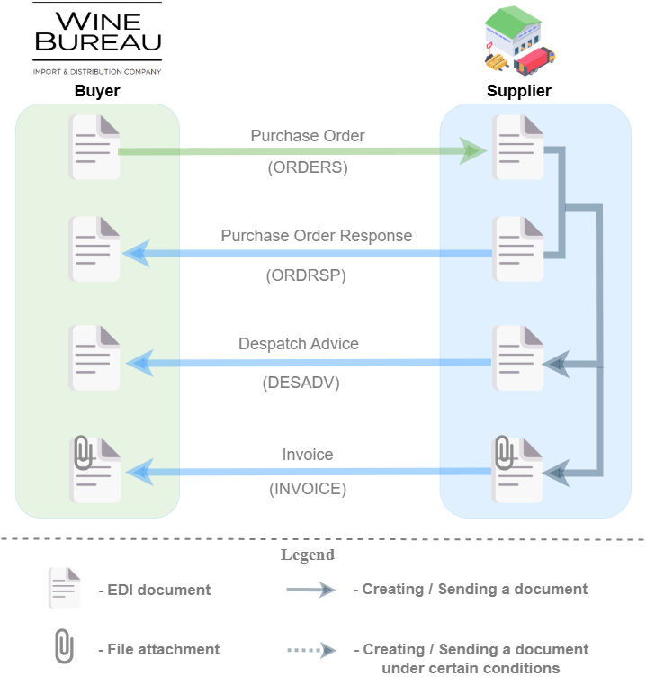

#############################################################################################################################################################
Document flow with the "Wine Bureau" Import and Distribution Company. Instructions for Supplier, which doesn't use EDIN platform
#############################################################################################################################################################

.. role:: red

.. contents:: Contents:
   :depth: 2

--------------

This instruction describes the document flow procedure with "Wine Bureau" Import and Distribution Company according to the scheme provided for international deliveries. Document flow is organized by the following documents:

- `Purchase Order <https://wiki.edin.ua/en/latest/XML/XML-structure.html#purchase-order-document-order>`__
- `Purchase Order Response <https://wiki.edin.ua/en/latest/XML/XML-structure.html#purchase-order-response-document-ordrsp>`__
- `Despatch Advice <https://wiki.edin.ua/en/latest/XML/XML-structure.html#despatch-advice-document-desadv>`__
- `Invoice <https://wiki-v2.edin.ua/books/xml-specifikaciyi-dokumentiv/page/raxunok-invoice>`__

**General document flow scheme:**

Distribution company creates and sends Purchase Order. Supplier should confirm the Purchase Order by creation of Purchase Order Response. If Supplier does not have a technical possibility to create Purchase Order Response, the step of Purchase Order Response creation can be skipped.
After that Supplier creates and sends Despatch Advice and Invoice based on Purchase Order (or Purchase Order Response if any).

--------------------

.. include:: /_constant/kontakti.rst
