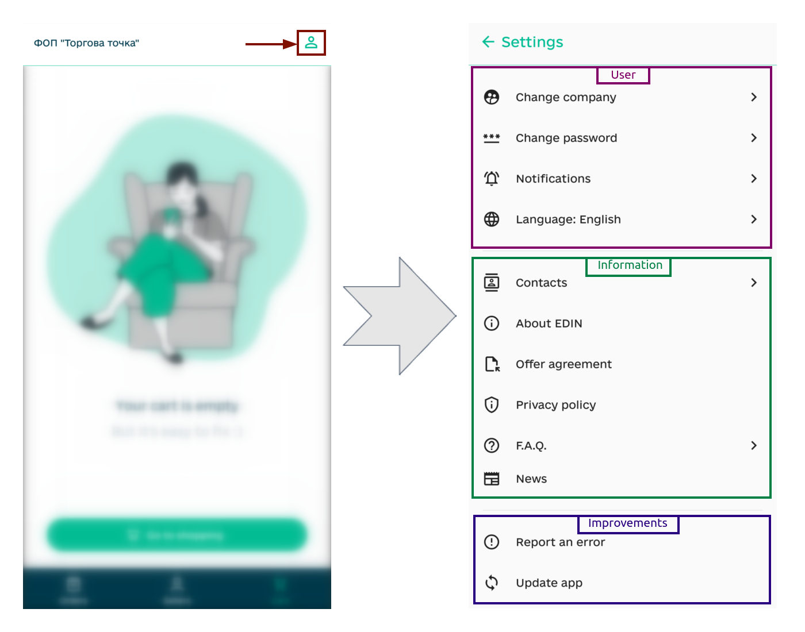

#################################################################################
Work in the "EDIN Market" application
#################################################################################

.. role:: green

.. role:: navy

.. role:: red

.. role:: orange

.. картинки:

.. |android_logo| image:: /_constant/icons/android_logo.png
                  :height: 20px

.. |google-play| image:: /_constant/icons/google-play.png
                  :height: 35px
                  :target: https://play.google.com/store/apps/details?id=org.edin.edinMarket

.. |apple_logo| image:: /_constant/icons/apple_logo.png
                  :height: 30px

.. |app-store| image:: /_constant/icons/app-store.png
                  :height: 35px
                  :target: https://apps.apple.com/ua/app/edin-driver-signing-waybill/id1658986357

.. |filter_app| image:: /_constant/icons/filter_app.png

.. |trash_app| image:: /_constant/icons/trash_app.png

.. |up_app| image:: /_constant/icons/up_app.png

.. |clock| image:: /_constant/icons/clock.png

.. |edit_app| image:: /_constant/icons/edit_app.png

.. |user_app| image:: /_constant/icons/user_app.png

.. |diskette| image:: /_constant/icons/diskette.png

.. contents:: Зміст:
   :depth: 4

---------

Introduction
==========================

The application **"EDIN Market"** was developed to work in the **Market** (ex **Distribution**) service and the usual exchange of electronic documents between Sellers (Manufacturers) and Buyers (Distributors) directly from your mobile phone/tablet. The application is available in the application stores **"Google Play Market"** (Android) and **"Apple App Store"** (iOS). This instruction describes the method of installing the application, setting it up, and forming the `ORDERS <https://wiki.edin.ua/uk/latest/Distribution/EDIN_2_0/XML/ORDER_x.html>`__ document at `Price List (PRICAT) <https://wiki.edin.ua/uk/latest/Distribution/EDIN_2_0/XML/PRICAT_x.html>`__ and other functionalities.

.. note::
   Only `registered <https://wiki.edin.ua/uk/latest/general_2_0/User_registration.html#register>`__ users of the **"EDI Network"** platform (already have **Login** and **Password**) can use the application. 

.. _app-install:

1 Installation and login to the **"EDIN Market"** application
===================================================================

.. tabs::

   .. tab:: |android_logo| On "Android"

      To install the application **"EDIN Market"** click on the button |google-play| or search for the widget by name in **"Google Play Market"**. Next, you need to **"Install"** the application:

      .. image:: pics_EDIN_Market/EDIN_Market_001.png
         :align: center

      The installed application **"EDIN Market"** can be immediately **"Open"** from **"Google Play Market"** or found among the installed applications on your device by the name:

      .. image:: pics_EDIN_Market/EDIN_Market_002.png
         :align: center

   .. tab:: |apple_logo| On "iOS"

      To install the **"EDIN Market"** application, click on the |app-store| button or search for the widget by name in **"Apple App Store"**. Next, you need to **"Install"** the application:

      .. image:: pics_EDIN_Market/EDIN_Market_012.png
         :align: center

      The installed application **"EDIN Market"** can be immediately **"Open"** from the **"Apple App Store"** or found among the installed applications on your device:

      .. image:: pics_EDIN_Market/EDIN_Market_013.png
         :height: 500px
         :align: center

After installation, to enter the application, you must pass authentication: enter your **Login** and **Password** of the user, press **"Sign in"**:

.. _auth:

2 User Registration/Authorization in the **"EDIN Market"** App
=======================================================================

To self-register in the **"EDIN Market"** app, the user needs to click the **"Register"** button on the login page, enter their email, create a password, and click **"Register"** again. After that, the user will receive an email with a confirmation link—click the link (valid for 72 hours) to verify your email:

.. image:: pics_EDIN_Market/EDIN_Market_059.png
   :align: center

.. attention::
   The letter could have gone to spam. Therefore, check not only "Inbox", but also "Spam". In case of spam, configure the rules so that the following emails from EDIN are not sent to spam.

To continue the registration, you need to create a user profile by filling out the following fields: Last Name, First Name, Position, Email, and Phone Number. To ensure that you're using your own mobile number, please verify it using an SMS code:

.. image:: pics_EDIN_Market/EDIN_Market_060.png
   :height: 500px
   :align: center

To verify your company data, enter the EDRPOU or RNOKPP (TIN), and we will pull all the information from public sources:

Registration is complete.

.. _main:

3 Main functional elements of the **"EDIN Market"** application
=====================================================================

The application **"EDIN Market"** has several main functional sections:

* **Orders** - work with already sent documents ("Orders");
* **Sellers** - search, selection of Sellers (your counterparties), review of Sellers products, formation of draft "Orders";
* **Cart** - viewing, editing "Orders"-drafts;
* **Settings** - company selection, account / application settings, additional information.

.. image:: pics_EDIN_Market/EDIN_Market_015.png
   :align: center

.. _prod-pricelist:

4 Viewing the "Price list" of the Seller (Manufacturer)
=====================================================================

To view the Seller's "Price List" in the **"Sellers"** section, you need to select one of your counterparties (you can search by name), after which a list of products will open (the Seller's name is displayed at the top of the screen):

.. hint::
   Sellers with an **Order Schedule** (more details below) will immediately see a note about the next date and time they will be able to accept "Orders".

Only current positions are displayed in the list of products. Each product item has its own name, price (UAH/EUR/US dollar with/without VAT depending on the Seller's settings), the size in which the product unit is sold, the date and time of publication of the item. Additionally (Seller's settings), product items may have images, marked "New" / "Bestseller" / "Addition" / "Public position" / "Promotion", indicated **quantity of products in stock** (available quantity), as well as the **Multiplicity** with which it is possible to specify the quantity of products to form an "Order": 

.. image:: pics_EDIN_Market/EDIN_Market_018.png
   :height: 200px

.. hint::
   If the Manufacturer indicates "Multiplicity" in the selected item, then when the Buyer forms an "Order", the number of ordered items must be a multiple of the indicated quantity. For example, if "Multiplicity"=3, then "Number of units" for forming "Order" can be 3, 6, 9...

Also, if the Seller has set **"Limits"** (the rules for forming "Orders" are set), then the corresponding button is displayed, when you click on it, the list of restrictions set by the Seller or the menu for viewing **Limits / Order schedule** is immediately displayed, if the latter is also installed by the Seller:

In the **Order Schedule**, the Seller indicates the days and times when he accepts "Orders". By choosing a date in the schedule, you can get acquainted with information on the acceptance of "Orders". Days of receiving "Orders" will be marked in green in the calendar; the hours of receiving "Orders" and reminders can be additionally indicated when viewing the date in the calendar:

.. attention::
   If the Seller (Manufacturer) has prohibited sending "Orders" outside of their **Order Schedule**, then when you send an order outside of the specified period, you will receive an error!

In order to avoid misunderstandings, the Seller (Manufacturer) can set up the sending of system notifications (as well as to the mail) about his readiness to accept "Orders".

All product positions of the "Price List" can be sorted by three levels. The first two levels are selected through the filter menu (button |filter_app|), and the third (the most accurate) is selected when scrolling the line (the number of products in this group is displayed in brackets); it is also possible to use the product search line by its name:

.. _order-create:

5 Creation of "Order" / "Preorder" according to the Seller's (Manufacturer's) Price List
=================================================================================================

Before starting, make sure that you have chosen the right company! To create a document, go to the **Sellers** section and select one (you can use the search by name).

.. hint::
   If you have already created a draft for this counterparty (this type of document is in the **"Cart"** section), then the "Price list" will open with the selected items (Draft editing mode "Order") and the **"Go to order"** button to continue editing the Draft!

Further, taking into account **Limits**, multiplicity and available products (more details in the `previous section of the instruction <https://wiki.edin.ua/en/latest/Distribution/EDIN_2_0/Instructions_2_0/EDIN_Market.html#prod-pricelist>`__) you need to specify the quantity of the product using the cursor or the buttons **«+»** / **«-»**. After all the products have been selected, you can **"+Create order"** (the number of product items is displayed in brackets):

.. image:: pics_EDIN_Market/EDIN_Market_023.png
   :align: center

.. hint::
   To create a "Preorder" for the selected Seller, use the ellipsis (**...**) to select **"Preorder"** in the available actions. If you have already created a draft for this counterparty (this type of document is in the **"Cart"** section), then there will be a note in the **"Preorder"** button, and when you click on the button, the previously created draft will open:

   .. image:: pics_EDIN_Market/EDIN_Market_033.png
      :align: center

   The main difference of "Preorder" is the ability to fill out and send the document without taking into account **Limits** (including the schedule), multiples and available products. Sent "Preorders" are marked in the **Orders** section with the |clock| icon.

.. note::
   The draft in this form is saved and available in the **"Cart"** section, where all created drafts are displayed. **"Cart"** displays the total amount for all drafts, as well as brief information for each of the drafts (seller's name, document type, number of product items, and total amount). The draft can be found (by the name of the seller) and continue editing, if necessary, it is possible to delete the draft using the |trash_app| button:

   .. image:: pics_EDIN_Market/EDIN_Market_028.png
      :height: 500px
      :align: center

The Draft "Order" is formed, consisting of blocks **To be paid**, a block with goods (**Products**) and a block **Order details**, which is filled with the details of the future document:

The information in the **To be paid** block is automatically recalculated upon changes and contains information about the number of product items in the created Order, total amounts with/without VAT. If the generated draft does not meet any of the Seller's **Limits** parameters, then such items are highlighted in the **To be paid** block in red, and if the current date does not fall into the **Order Schedule**, you will also see a notification. When you try to **"Send order"** without changes, you will receive a prompt about the need to take into account the Seller's parameters:

The **Products** block allows you to add (**+**) / delete (**-**) the quantity of the ordered product (taking into account availability and multiplicity) right in the draft. It is also possible to delete a product item completely (buttons **«-»** / **"X"**) or **"+Add product"** from the Seller's "Price List" using the button of the same name, select and **"+Add to order"**:

After all the fields in the **To be paid** block are black, for convenience, you can collapse (|up_app|) the product items and proceed to fill in the details (the **Order details** block) - mandatory fields are marked asterisk:

When filling in the "Preferred delivery date" a calendar opens for selecting a date, the "Delivery Place" field immediately displays a list of available addresses, among the "Payment methods" you can choose **Cash payment/Cashless payment**, in the "Shipping conditions" you need to choose **Self-delivery/Delivery by seller's transport** and add a comment if necessary before **"Send order / preorder"**: 

After that you need to press the **"Send order / preorder"** button and if the "Order" / "Preorder" was created correctly, then after sending you can **"Go to order / preorder"** or **"Continue shopping"** in the **Sellers** section (in case of non-compliance with the imposed restrictions, you will receive a notification about the reason and the need for editing - it is described in more detail in the `previous section of the instruction <https://wiki.edin.ua/en/latest/Distribution/EDIN_2_0/Instructions_2_0/EDIN_Market.html#prod-pricelist>`__):

The submitted "Order" / "Preorder" is automatically displayed in the **"Orders"** section.

.. _order-repeat:

5.1 Repeat "Order" / "Preorder"
----------------------------------------------------------------

If necessary, it is possible to **"Repeat order"** (create a draft "Order" / "Preorder" with data identical to the already sent document). To do this, you need to open the sent document in the **Orders** section and select **"Repeat order"** in the available actions with the help of an ellipsis (**...**); it remains to specify the delivery date and click **"Send order/preorder"**:

.. note::
   If you have already created a draft for this counterparty (this type of document is in the **"Cart"** section), then there will be a note in the **"Repeat order"** button, and when you click the button, you can choose an action: **"Replace"** or **"Merge"** products in the cart for this counterparty:

   .. image:: pics_EDIN_Market/EDIN_Market_032.png
      :align: center

The automatically created Draft can be sent immediately or after editing.

.. _order-repeat:

5.2 Replace/edit "Order"
----------------------------------------------------------------

.. attention::
   It is possible to edit the sent "Order" until the counterparty has responded to it (the document is in status :navy:`"Sent"`)!

To edit the sent "Order" in the **"Orders"** section, you need to select a document in the :navy:`"Sent"` status (for convenience, you can use the `search <https://wiki.edin.ua/en/latest/Distribution/EDIN_2_0/Instructions_2_0/EDIN_Market.html#doc-search>`__). Next, with the help of an ellipsis (**...**) in the available actions, you need to select **"Order replace"**. At the same time, an "Replace order" draft is automatically created in the **"Cart"**, which allows you to delete / add products (from the Seller's "Price List"), change the ordered quantity of products (according to the specified availability, multiples of the product, the imposed **Limits**) and details of the document :red:`except "Delivery place"`:

.. note::
   If you have already created a draft for this counterparty (this type of document is in the **"Cart"** section), then there will be a note in the **"Replace order"** button, and when you click the button, you can choose an action: **"Replace"** or **"Merge"** products in the cart for this counterparty:

   .. image:: pics_EDIN_Market/EDIN_Market_039.png
      :align: center

After the document has been edited, it is possible to **"Send replace order"**. The sent "Replace order" in the **"Orders"** section are marked with the |edit_app| icon, and the "Order" itself indicates changes by the ordered quantity and the date of the document change (last edit):

In this way, one "Order" can be edited multiple times (as long as it is in the :navy:`"Sent"` status), and all changes can be tracked in the `"Order History" <https://wiki.edin.ua/en/latest/Distribution/EDIN_2_0/Instructions_2_0/EDIN_Market.html#history>`__.

.. _next-steps:

6 Further document management
=====================================================================

After sending the "Order" / "Preorder", the documents are displayed in the **"Orders"** section, where they can be viewed and all further actions are carried out. Documents change their status during their life cycle:

* :navy:`"Sent"` - all sent "Orders" / "Preorders" / "Replace order" that have not yet received a response from the counterparty;
* :orange:`"In process"` - all "Orders" / "Replace order", to which the Seller (Manufacturer) has provided an answer (documents are awaiting receipt of the products);
* :green:`"Completed"` - all "Orders" / "Preorders" / "Replace order",according to which the delivery of products was completed (final status of the document).

.. note::
   :green:`"Returned"` status is used for the **Return products** process (more details in the `next section of the instruction <https://wiki.edin.ua/uk/latest/Distribution/EDIN_2_0/Instructions_2_0/EDIN_Market.html#products-return>`__).

.. _doc-search:

6.1 Document search
----------------------------------------------------------------

It is possible to sort documents in the **"Orders"** section by status by selecting one of the quick filters available when scrolling the line sideways:

.. image:: pics_EDIN_Market/EDIN_Market_034.gif
   :height: 700px
   :align: center

or by opening the advanced search menu with the |filter_app| button. It is possible to find documents by one or more criteria, including "Document number" (the search works by part of the number), "Document date or period", "Seller", Type and Status of the document:

.. image:: pics_EDIN_Market/EDIN_Market_036.gif
   :height: 700px

According to the selected criteria, press the **"Search"** button - if your documents match them, they will be found. The number of documents is indicated in the "Found" field, it is possible to return to the advanced search menu using the |filter_app| button; **"Reset filter"** is also possible:

.. _products-acceptance:

6.2 Accept products
----------------------------------------------------------------

After the Seller (Manufacturer) forms confirmation and/or shipment according to your "Order", this document automatically changes its status to :orange:`"In Process"` (the action of your counterparty is reflected in `"Order History" <https://wiki.edin.ua/en/latest/Distribution/EDIN_2_0/Instructions_2_0/EDIN_Market.html#history>`__).

.. note::
   Of course, if your process involves accepting goods without a digital response, then you can also **"Mark as completed"** "Orders" that are in the :navy:`"Sent"` status.

In order to accept the confirmed/shipped product, you need to select a document in the **Orders** section (for convenience, you can use the `search <https://wiki.edin.ua/en/latest/Distribution/EDIN_2_0/Instructions_2_0/EDIN_Market.html#doc-search>`__) and press **"Accept product"**. You can view all products (search by product name is available) and **"Sent"** acceptance of the counterparty's product:

If the quantity of the product you actually accept does not correspond to the quantity in the document, it can be changed using the cursor or **«+»** / **«-»** buttons, after pressing the **"Continue"** button, a form will open to you only with those products that have discrepancies (changes are automatically marked in yellow). If necessary, you can individually "+Add a reason" for the discrepancy for each product by selecting it from the list:

The chosen reason for the discrepancy can be **Delete** (|trash_app|) or **"Change reason"** (reselect from the list). After entering the reasons for discrepancies, you need to **"Send"** the acceptance of the products to the counterparty.

After sending the acceptance of the products, the "Order" changes its status to :green:`"Completed"` (Accepted), when viewing the document, the date of the change (last action) is displayed, the final number of accepted products, discrepancies and their reasons (if any) are highlighted:

Document flow is complete.

.. _products-return:

6.3 Return products
----------------------------------------------------------------

.. attention::
   This functionality is implemented for Manufacturers (Sellers) that work and allow the return of perishable products! 

Goods are returned using the **"+Return products"** button in the **Orders** section. Next, you need to select the Seller (Manufacturer) from the list of your counterparties (search by name), enter the number of days for the return and click **"Create return"**. After that, an incomplete list of products from recent orders is displayed (search by product name), which can be selected selectively or **"Select all"** to process the return and **"Continue"**:

Next, the return form opens, where in the **Products** block you can specify the quantity of the product (**«+»** / **«-»** buttons), indicate the reason for the return (**"+Add reason"**) or **"+Add product"** from the "Price list" of the selected Seller (Manufacturer), even if you did not "order" it through our service:

The return draft at the filling stage can be deleted using the |trash_app| button. After adding all the product items and their quantity, for convenience, they can be collapsed (|up_app|) and proceed to fill in the details (block **Return details**) - mandatory fields are marked with an asterisk:

When you fill in the "Preferred return date" a calendar opens to select the date, the "Return place" field immediately displays a list of available addresses and add a comment if necessary before **"Send return"**:

If the return was created correctly, after sending you will be able to **"View document"** or **"Return to order list"** in the **Sellers** section. The sent return is automatically displayed in the **"Orders"** section (for convenience, you can use the `search <https://wiki.edin.ua/en/latest/Distribution/EDIN_2_0/Instructions_2_0/EDIN_Market.html#doc-search>`__):

When viewing the document, the quantity and reason (if available) for the return of products, the preferred date and place of return are displayed.

.. _history:

6.4 Order history
----------------------------------------------------------------

The history appears in the "Order" if some action has been performed with it: "Order editing" (Buyer) has been created; confirmation / shipment (Seller); acceptance (Buyer). That is, when the document is in the status :orange:`"In process"` / :green:`"Completed"`, it definitely has a "history". In order to view the history of the document, you need to use the ellipsis (**...**) in the available actions to select **"Order history"**, where the main changes to the document are displayed: the total amount and by quantity, the price of each product item :

.. _settings:

7 Settings and useful information
=====================================================================

The **Settings** section is available by clicking the |user_app| button. **Settings** can be conditionally divided into functional blocks where your personal settings, policy and rules for using the application, our contacts and other useful information are stored:

--------------------------

In order to **"Change company"** you need to select and click on your company from the list (the current company is marked with a tick and highlighted in green):

--------------------------

In order to **"Change password"** you need to enter your current password in the open form, enter a new password (at least 6 characters), re-enter the new password (to avoid typos) and necessarily **Save** made changes using the button with the |diskette| icon:

.. image:: pics_EDIN_Market/EDIN_Market_052.png
   :height: 500px
   :align: center

--------------------------

To **set up service notifications**, you need to select **"Notifications"** and enable/disable notifications to Mail and directly to Phone (your device) from the application:

--------------------------

The application interface is currently available in two **languages**: Ukrainian (default) and English:

.. image:: pics_EDIN_Market/EDIN_Market_054.png
   :height: 500px
   :align: center

-----------------------------

.. hint::
   In the information block, you can always find our contacts, information about the company, re-read the agreement/policy, familiarize yourself with the news and quickly find answers to common questions right inside our application!

-----------------------------

Let us know immediately when you receive an error in the application: in **"Settings"** select **"Report an error"** and specify the reason for the error ("what is not working as it should") in text:

.. hint::
   It is also possible to contact technical support in a way that is convenient for you (phone, telegram, e-mail):

   .. image:: pics_EDIN_Market/EDIN_Market_056.png
      :height: 500px
      :align: center

-----------------------------

We recommend timely **"Update app"**. You will also receive a notification that a new version of the application is available (if you ignore the need to update the application for a long time, it may stop working):

-----------------------------

.. hint::
   If the device on which the application is installed is used by several users: we strongly recommend that you **"Logout"** the application before transferring such a device to another person to protect your confidential information! 

   .. image:: pics_EDIN_Market/EDIN_Market_058.png
      :height: 500px
      :align: center

.. _delete-account:

8 Deleting your account in EDIN "Market" App
====================================================================

.. caution::
   We care about the confidentiality of your credentials, and you can **"Delete account"** by specifying the reason and reconfirming the action with the button:

   .. image:: pics_EDIN_Market/EDIN_Market_062.png
      :height: 500px
      :align: center

   However, you should know that you will be deprived of the opportunity to use EDIN Market, and other participants of electronic document circulation will be deprived of the opportunity to exchange electronic documents with you using EDIN Market! You may find out more about the deletion and storage of data from our `Privacy Policy <https://wiki.edin.ua/en/latest/Legal_info/Politic.html>`__ (p.5 and p.9.2.3 respectively).

-------------------------------------

.. include:: /_constant/kontakti.rst

