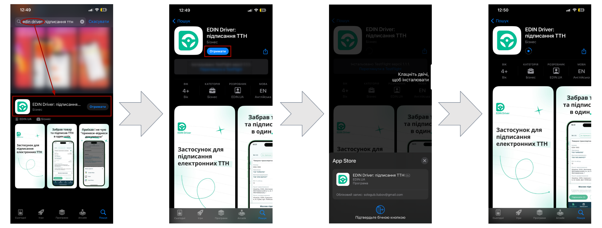

########################################################################################################################
|apple_logo| **iOS** | Work in "EDIN Driver" application (instructions for Drivers)
########################################################################################################################

.. сюда закину немного картинок для текста

.. |diskette| image:: /_constant/icons/diskette.png

.. |green_trash| image:: /_constant/icons/green_trash.png

.. |apple_logo| image:: /_constant/icons/apple_logo.png
                  :height: 30px

.. |app-store| image:: /_constant/icons/app-store.png
                  :height: 35px
                  :target: https://apps.apple.com/ua/app/edin-driver-signing-waybill/id1658986357

.. contents:: Contents:
   :depth: 5

---------

.. attention::
   For the correct operation of the service, the application **"EDIN Driver"** and all applications on which signing depends must be updated to the latest version!

.. _app-install:

1 Installation **"EDIN Driver"** application
==============================================

To install the **"EDIN Driver"** application, click on the |app-store| button or search for the widget by name in **"Apple App Store"**. Next you need to **"Get"** the app (requires confirmation):

The installed application **"EDIN Driver"** can be immediately **"Opened"** from the **"Apple App Store"** or found among the installed applications on your device by the name:

.. image:: pics_iOS/iOS_002.png
   :align: center

.. include:: /Driver/Instructions/Android.rst
   :start-after: .. початок блоку для Android_to_iOS_001
   :end-before: .. кінець блоку для Android_to_iOS_001

---------------------------------

.. include:: /_constant/kontakti.rst

