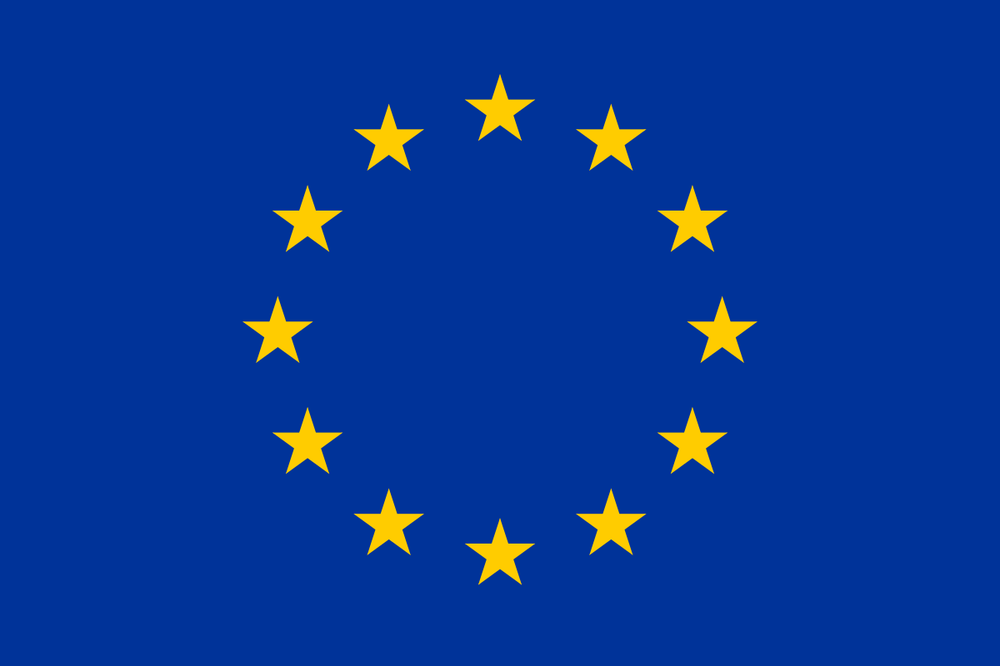

Initiative Letter
######################################################################################

.. стаття не відображається

--------------------------------------------

⠀⠀⠀⠀⠀⠀⠀⠀⠀⠀⠀⠀⠀⠀⠀⠀⠀⠀⠀⠀⠀⠀⠀⠀⠀⠀⠀

Dear Partners,

By this letter we (EDIN, EDI-provider of Ukraine) announce a common European initiative of development communications and business interaction between Ukrainian and European retail businesses.

The objective of this initiative is to establish quick e-communications between European Suppliers/Producers and Ukrainian leading Retailers to order and buy the necessary products/goods and provide for the Ukrainian population, because of a difficult military and political situation in the country.

EDIN (Ukrainian EDI-provider which operates with 120+ retailers and 4000+ suppliers) together with long-term affiliated European associations, partners and providers initiated to set up the business process between the European market of Suppliers of products/goods and Ukrainian Retailers. 
Our cooperation has a successful history of more than 10 years and is confirmed by the reliability of cooperation with European associations, partners and providers.
The companies have been interacting for many years by the real electronic exchange of transactions with leading European retailers Rewe Group, Metro AG, etc. and a lot of suppliers such as Unilever, P&G, Coca-Cola, Pepsico, Mondelez, Mars, Henkel, Loreal, Danone, JTI, Philip Morris, BOSCH, Philips, etc., and including support of European associations and our partners such as `EU4Digital <https://eufordigital.eu/eu4digital-and-edelivery-what-do-they-mean-for-digitalisation-in-ukraine/>`__, `EDISON and EDITEL GROUP <https://www.edison.pl/aktualnosci-edison/274-wesprzyj-z-nami-ukrainskich-detalistow>`__, `EBA <https://eba.com.ua/en/ye-tovar-servis-dlya-zabezpechennya-naselennya-potribnymy-tovaramy/>`__, `WH <https://www.wiadomoscihandlowe.pl/artykul/szukamy-dostawcow-dla-ukrainskich-sieci-handlowych?utm_source=newsletterWHpl_2&utm_medium=newsletter>`__, `DIIA <https://business.diia.gov.ua/en/cases/servis/servis-e-tovar-dla-zapobiganna-deficitu-neobhidnih-tovariv-ta-optimizacii-postavok>`__, `GS1 <https://gs1ua.org/ua/news/ye-tovar-servis-dlya-zabezpechennya-naselennya-potribnimi-tovarami>`__, etc.

EDIN has developed an e-service which allows the European Suppliers and Producers to upload their Catalogs of products and goods (including their contacts) simply and quickly by using the web-cabinet. After that the Ukrainian Retailers see these catalogs in real time and can send an Orders for delivery, or contact the suppliers. 
And vice versa - European Retailers can use this e-service to see Catalogs of Ukrainian Suppliers and Producers and to send them Orders, or to contact them. Links and details about e-service EDIN below: 

* `Service landing page <https://www.solutions.edin.ua/en>`__ 
* `Service registration link <https://edo-v2.edin.ua/register?redirect_link=/service/openprice&source=world>`__
* `WEB interface manual <https://wiki.edin.ua/en/latest/Openprice/Instructions/Openprice_instruction.html>`__
* `API integration <https://wiki.edin.ua/en/latest/API_Openprice/API_Openprice_list.html#>`__
* `Presentation of project and service <https://drive.google.com/file/d/1ULPrfXWlxBLmBgTQmIk881TUj3UP5lIC/view?usp=sharing>`__ 

The purpose and mission of the service is to prevent a shortage of necessary goods for the population in Ukraine and optimize international supplies.

Your response to cooperation and participation in the project is very important for Ukraine and Ukrainian people! 

For more information please contact `help@edin.ua <mailto:help@edin.ua>`__!
