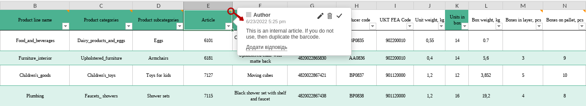
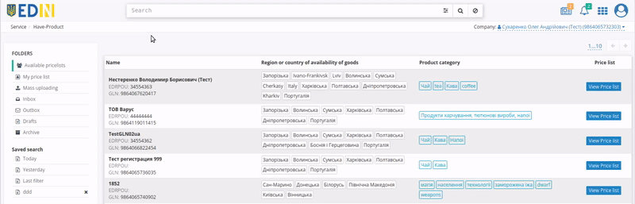

Instructions for working with "Have Product" service
###############################################################################

.. примітка: багато функціоналу переїхало з Distribution

.. сюда закину немного картинок для текста

.. |advserch| image:: pics_Openprice_instruction/Openprice_instruction_009.png

.. |pencil| image:: pics_Openprice_instruction/Openprice_instruction_002.png

.. |смітник| image:: pics_Openprice_instruction/Openprice_instruction_003.png

.. |non| image:: pics_Openprice_instruction/Openprice_instruction_044.png

.. |лупа| image:: pics_Openprice_instruction/Openprice_instruction_043.png

.. role:: red

.. role:: green

.. role:: blue

.. role:: orange

.. role:: underline

---------

.. contents:: Contents:
   :depth: 3

---------

Introduction
===================================

**"Have Product"** - it is a complex electronic solution focused primarily on quick product search and easy creation of electronic orders.

**"Have Product"** service allows contractors to act in the roles of **Buyer** (**Distributor**) and **Seller** (**Producer**) depending on the actions in the service. This instruction describes the procedure for creating your own `"Price list" (PRICAT) <https://wiki.edin.ua/en/latest/Distribution/EDIN_2_0/XML/XML_structure.html#pricat>`__ and the formation of `"Order" (ORDERS) <https://wiki.edin.ua/en/latest/Distribution/EDIN_2_0/XML/XML_structure.html#order>`__ based on the "Price list" (PRICAT) of other users of **"Have Product"** service.

.. note:: All data given in the Instructions - fictitious, are used only as an example.

1 Login to the platform
====================================

.. include:: /general_2_0/rabota_s_platformoj_EDIN_2.0.rst
   :start-after: .. початок блоку для Enter
   :end-before: .. кінець блоку для Enter

After successful authorization, the main menu will open, where in the tab **"Services"** You need to select **"Have Product"** service:

-----------------------------------------

The side menu of the **"Have Product"** service contains the following sections:

* **Available pricelists** - section, which displays all available price lists of users **"Have Product"** service;
* **My price list** - section that displays your (current GLN) `"Price List" (PRICAT) <https://wiki.edin.ua/en/latest/Distribution/EDIN_2_0/XML/XML_structure.html#pricat>`__;
* **Mass uploading** - functionality of mass loading of goods in Your `"Price List" (PRICAT) <https://wiki.edin.ua/en/latest/Distribution/EDIN_2_0/XML/XML_structure.html#pricat>`__;

* **Inbox** - all incoming documents for your organization from contractors;
* **Outbox** - all documents sent from your organization to contractors;
* **Drafts** - all documents which were created but not sent;
* **Archive** - all processed and archival documents (transferred to the archive).

Filters of documents by date are made separately (**"Today"**, **"Yesterday"**). The last entered search is saved by the platform automatically and when you press the button **"Last filter"** it is performed again in that folder ("Inbox" / "Outbox" / "Archive" / etc.), where you were before (you will be redirected).

.. _sale:

2 Work with Buyers (sale)
===================================

In order to start working with your customers, you need to submit Your `"Price List" (PRICAT) <https://wiki.edin.ua/en/latest/Distribution/EDIN_2_0/XML/XML_structure.html#pricat>`__: go to the section **Mass uploading** and read the rules for creating your price list by downloading it in .xls format:

You can add your own price list using the **"Upload from Excel"** button (2). At first download the template using the button **"Download Excel template"** (1) for the correct formation of the price list. The .xls template download will start automatically.

.. important::
   Pay attention! You cannot delete or swap columns in a template. You may not fill in optional columns, but do not delete them.

Open and fill the Excel file. Columns highlighted in green - **required**! Some columns have tooltips - place the cursor to the cell name to display a tooltip: 

There are filters in the table header that allow you to select the displayed values.

 .. hint::
   The value of the cells ``Category -> Group -> Subgroup`` are selected sequentially from a multi-level drop-down list:

   .. image:: pics_Openprice_instruction/Openprice_instruction_048n.png
      :align: center

Required data in the template:

- Country product availability
- Category
- Group
- Subgroup
- Vendor code
- Description
- Barcode
- Units in a box
- Price/unit without VAT, UAH

.. hint::
   Quota for orders - a limit on the number of units of a particular product, which can be specified at an "Order" form stage.

After filling out the template, save it! To upload the price list to the platform, click on the **"Upload from Excel"** button and select the saved file in a new window.

.. note::
   If the user does not have a contact person with the type "Responsible for the price list" in the `account <https://wiki.edin.ua/uk/latest/Personal_Cabinet/PCInstruction.html#account-profile>`__, then at first a modal window appears for `adding this contact person <https://wiki.edin.ua/en/latest/Openprice/Instructions/Openprice_instruction.html#contacts>`__.

If one of the columns is filled in incorrectly, the position will be painted orange and an error message will appear indicating which column needs to be corrected:

If all the information is filled in correctly, you will see a list of added products. Check all the items you want to add. Even if some positions are added incorrectly, you still can add positions without errors:

Selected items can be **"Publish"** - products are automatically added to your price list (**"My price list"** section) of the current GLN.

.. note::
   Note that before **"Publish"** operation, you can check and edit (|pencil|) the data of each downloaded position:

   .. image:: pics_Openprice_instruction/Openprice_instruction_033.png
      :align: center

.. hint::
   "Country product availability" can be selected from the list, and filling in the optional field "Product availability area" is available only for "Country product availability"=Ukraine:

   .. image:: pics_Openprice_instruction/Openprice_instruction_050.gif
      :align: center

Published positions are immediately reflected in all **Buyers** and will be valid for "Orders" forming. Notification of the publication of new products will be sent by e-mail with the main criteria of the products and a link to company price list.

2.1 View and edit Your "Price List"
---------------------------------------------------------

Your `"Price List" (PRICAT) <https://wiki.edin.ua/en/latest/Distribution/EDIN_2_0/XML/XML_structure.html#pricat>`__ of the current GLN with all current items is in the section **"My price list"**. When you go to the section, a new price list window opens with all the added items grouped by the following: ``Category -> Group -> Subgroup`` product hierarchy:

Each of these three levels by clicking on the name can be hidden / opened for easier **viewing / editing / deleting**. The "Name" column is sorted by ascending value according to the rule: ``voids, numbers (0 to 9), spaces, special characters, letters A to Z, letters A to Z`` and in descending order:

Also with the help of the `Search <https://wiki.edin.ua/en/latest/Openprice/Instructions/Openprice_instruction.html#search>`__ Category (at the top of the screen) it is possible to filter the list of goods.

To display detailed information about the product, press the **∨** button next to an Article:

To **edit** position data, you need to click on its name, then a modal window will open with position data (fields marked with a red asterisk :red:`*` **are required**):

.. image:: pics_Openprice_instruction/Openprice_instruction_038.png
   :align: center

.. hint::
   "Country product availability" can be selected from the list, and filling in the optional field "Product availability area" is available only for "Country product availability"=Ukraine:

   .. image:: pics_Openprice_instruction/Openprice_instruction_050.gif
      :align: center

The data of the field "Region or country of availability of goods" is selected from the list (the list is automatically filtered when you enter the region / country name):

You can delete positions with |смітник| button or completely **"Delete"** price list (actions need to be confirmed):

.. _contacts:

With the **"My contact person"** button it is possible to add a new or edit an existing contact with the type "Responsible for the price list", which will be displayed to contractors when they viewing your "Price list":

All your contacts can be viewed / edited / deleted in the `account <https://wiki.edin.ua/uk/latest/Personal_Cabinet/PCInstruction.html#account-profile>`__.

In the pop-up window you must to specify the name of the contact (enter manually and **"Apply the entered value"** or select from the list of users (search is possible)), mobile phone number, select from the list of positions and **"Save"** contact.

If the contact with the type "Responsible for the price list" already exists, then clicking on the **"My contact person"** button opens an already filled pop-up window for editing:

.. _purchase:

3 Work with Sellers (purchase)
===================================================

After selecting **"Have Product"** service, the page with all available `"Price Lists" (PRICAT) <https://wiki.edin.ua/en/latest/Distribution/EDIN_2_0/XML/XML_structure.html#pricat>`__ ("Available pricelists") is automatically displayed:

The table shows brief information about the **Seller** (Name, USREOU, GLN), indicates the region or country of availability of goods, product Group.

Also with the help of the `Search <https://wiki.edin.ua/en/latest/Openprice/Instructions/Openprice_instruction.html#search>`__ (at the top of the screen) it is possible to filter the desired counterparties by Name/USREOU/GLN of the company, by region/country of goods availability or by product hierarchy (``Category -> Group -> Subgroup``):

.. attention::
   Only one parameter can be specified for search / filtering. In order to  **"Reset Price list filters"** you need to click on the |non| button in the Search line.

For more detailed information on the content of any document in the journal, you can use the **"View Price list"** button in the appropriate column against the selected **Seller**:

.. image:: pics_Openprice_instruction/Openprice_instruction_012.png
   :align: center

A new price list window will open with all added items grouped by the following: ``Category -> Group -> Subgroup`` product hierarchy:

Each of these three levels by clicking on the name can be hidden / opened for easier viewing and next `"Order" (ORDERS) <https://wiki.edin.ua/en/latest/Distribution/EDIN_2_0/XML/XML_structure.html#order>`__ creation. The "Name" column is sorted by ascending value according to the rule: ``voids, numbers (0 to 9), spaces, special characters, letters A to Z, letters A to Z`` and in descending order:

Also with the help of the `Search <https://wiki.edin.ua/en/latest/Openprice/Instructions/Openprice_instruction.html#search>`__ Category (at the top of the screen) it is possible to filter the list of goods.

By clicking on the **"Seller's contacts"** button it is possible to view the contact details of the responsible person:

To display detailed information about the product, click on these items:

If the **Seller** informs his **Buyers** about the balances in the warehouse (sends in the Price list his data about product balances)  then values are displayed in the form in the column **Balance**. Quantity of goods more than **Balance** cannot be issued even if **Order quota** is not set (maximum quantity of goods in one order set by **Seller**):

Only the **Seller** adds :red:`Novelty!`, :blue:`Action!` and :orange:`In-pickup!` marks.

3.1 Creating an "Order" according to the "Price List"
----------------------------------------------------------------------------------

To create an `Order (ORDERS) <https://wiki.edin.ua/en/latest/Distribution/EDIN_2_0/XML/XML_structure.html#order>`__, you need to fill in the **Ordered quantity** and **Ordered box quantity** columns. It is necessary to reckon in the quotas and the balance of the goods if **Seller** set them to price list:

The values are calculated automatically for all selected items and for the entire `Order (ORDERS) <https://wiki.edin.ua/en/latest/Distribution/EDIN_2_0/XML/XML_structure.html#order>`__ document in EDIN **"Have Product"** service:

* Total number of items in the order = number of blocks in POSITION in the Order (ORDERS)
* Total number of boxes = sum of all BOXESCOUNT values in the Order (ORDERS)
* Total number of pallets = sum of all PALLETS values in the Order (ORDERS)
* Total weight of the order = sum of all WEIGHT multipliers * BOXESCOUNT in Order (ORDERS)
* Order amount with VAT = sum of all values of ORDEREDQUANTITY multipliers * PRICEWITHVAT in Order (ORDERS)
* Order amount without VAT = sum of all values of ORDEREDQUANTITY multipliers * ORDERPRICE in Order (ORDERS)

You can **Save** entered information and return to `Order (ORDERS) <https://wiki.edin.ua/en/latest/Distribution/EDIN_2_0/XML/XML_structure.html#order>`__ later (to continue processing the Order You need to :underline:`anew` open the same price list of the **Seller**):

When the goods are selected (**Ordered quantity** and **Ordered box quantity** are specified) it is possible to **"+Create order"**:

.. attention::
   When creating an Order, the system checks the specified values and reports discrepancies that need to be corrected for document creation (checks exceeding quotas or quantity of goods on the balance values specified by **Seller**):

   .. image:: pics_Openprice_instruction/Openprice_instruction_020.png
      :align: center

If the correct values of quotas / balance are entered, then when **Seller** press the button **"+Create order"** the "Order form" will open (fields marked with a red asterisk :red:`*` **are required**):

- № :red:`*` - available for editing (without a mark);
- from :red:`*` - specify the date of the order;
- Delivery date :red:`*` - specify the delivery date;
- Delivery place - select a delivery location from the drop-down list;
- Delivery terms - select a delivery terms from the drop-down list;
- Supplier - Seller's GLN from the price list, not available for editing;
- Buyer - Buyer's GLN from the price list, not available for editing;
- Currency: UAH - not available for editing;
- Document type: Original - not available for editing.

After checking and filling in the basic data it is possible to **Send** document:

The sent document is displayed in **"Outbox"** folder (more details at `link <https://wiki.edin.ua/en/latest/Openprice/Instructions/Openprice_instruction.html#order>`__).

.. _order:

4 View "Order"
===================================================

Depending on the role of the user-participant (**Buyer** / **Seller**) the `Order (ORDERS) <https://wiki.edin.ua/en/latest/Distribution/EDIN_2_0/XML/XML_structure.html#order>`__ document gets in **"Outbox"** (for **Buyer**) or in **"Inbox"** (for **Seller**), for example:

In these directories `Order (ORDERS) <https://wiki.edin.ua/en/latest/Distribution/EDIN_2_0/XML/XML_structure.html#order>`__ is not available for editing, it can only be viewed, check the specified data (GLN Buyer, GLN Place of delivery, delivery date ...), the tabular part with product items.

.. admonition::
   For **Buyer**:

   This `Order (ORDERS) <https://wiki.edin.ua/en/latest/Distribution/EDIN_2_0/XML/XML_structure.html#order>`__ may be replaced by the **"New"** (1) document at review form. In this case, the process of cloning the contents of the document for further editing is started. Such document is added to the document chain automatically (`more details <https://wiki.edin.ua/en/latest/Openprice/Instructions/Openprice_instruction.html#edi-uzd>`__ about integration with **"EDI+ESD"** service):

   .. image:: pics_Openprice_instruction/Openprice_instruction_023.png
      :align: center

.. admonition::
   For **Seller**:

   You may be able to create a document view form **"Order response" (ORDRSP), "Despatch advice" (DESADV), "Receipt advice" (RECADV), "Invoice" (INVOICE), "Sales Invoice" (COMDOC_006)** (`more details <https://wiki.edin.ua/en/latest/Openprice/Instructions/Openprice_instruction.html#edi-uzd>`__ about integration with **"EDI+ESD"** service):

   .. image:: pics_Openprice_instruction/Openprice_instruction_042.png
      :align: center

Regardless of the user role, You can **"Download"** (2) `Order (ORDERS) <https://wiki.edin.ua/en/latest/Distribution/EDIN_2_0/XML/XML_structure.html#order>`__ in .pdf, .xls, .xml, .zip format or immediately **"Print"** the document.

The tabular part displays the basic information about product position. Product positions has **∨** / **∧** buttons in the "№" and **"Show all"** / **"Hide"** buttons for the whole table:

**Seller** / **Buyer** role users can add their Comments to the sent document (comment cannot be deleted):

**Inbox** / **"Sent"** / **"Archive"** journal documents with comments are marked (|comment|). Hovering over that icon displays the number of comments:

.. _transport-search:

4.1 Transport search (integration with Lardi Trans)
-------------------------------------------------------------------

.. include:: /Openprice/Instructions/Transport_Search.rst
   :start-after: .. початок блоку для TransportSearch
   :end-before: .. кінець блоку для TransportSearch

.. _edi-uzd:

5 Work with EDI and ESD
===================================

The user has access to work with the following documents:

* `Order (ORDERS) <https://wiki.edin.ua/en/latest/XML/XML-structure.html#order>`__
* `Order response (ORDRSP) <https://wiki.edin.ua/en/latest/XML/XML-structure.html#ordrsp>`__
* `Despatch advice (DESADV) <https://wiki.edin.ua/en/latest/XML/XML-structure.html#desadv>`__
* `Receipt advice (RECADV) <https://wiki.edin.ua/uk/latest/XML/XML-structure.html#recadv>`__
* `Invoice (INVOICE) <https://wiki.edin.ua/uk/latest/XML/XML-structure.html#invoice>`__
* `Sales Invoice (COMDOC_006) <https://wiki.edin.ua/en/latest/XML/XML-structure.html#comdoc-006>`__

The documents are logically linked in so-called chains:

There are possible document flow schemes / combinations (the sender of the document is indicated in parentheses):

1) ORDERS (**Buyer**) -> ORDRSP (**Seller**) -> DESADV (**Seller**) -> RECADV (**Buyer**) -> INVOICE (**Seller**)
2) ORDERS (**Buyer**) -> ORDRSP (**Seller**) -> DESADV (**Seller**) -> COMDOC_006 (**Seller**)
3) ORDERS (**Buyer**) -> ORDRSP (**Seller**) -> INVOICE (**Seller**)
4) ORDERS (**Buyer**) -> ORDRSP (**Seller**) -> COMDOC_006 (**Seller**)
5) ORDERS (**Buyer**) -> ORDRSP (**Seller**) -> RECADV (**Buyer**) -> INVOICE (**Seller**)
6) ORDERS (**Buyer**) -> DESADV (**Seller**) -> RECADV (**Buyer**) -> INVOICE (**Seller**)
7) ORDERS (**Buyer**) -> DESADV (**Seller**) -> COMDOC_006 (**Seller**)
8) ORDERS (**Buyer**) -> INVOICE (**Seller**)
9) ORDERS (**Buyer**) -> COMDOC_006 (**Seller**)

.. _search:

6 Search
=====================================================

The search for documents/items in the **Have Product** service is performed via the **"Search"** line:

.. hint::
   The general concept of `working with the search <https://wiki.edin.ua/uk/latest/general_2_0/rabota_s_platformoj_EDIN_2.0.html#doc-search>`__ is outlined in the link.

When entering the value is completed, You need to press **"Search"** / |лупа|. The **Search** Category is cleared by the **"Reset filters"** button / |non|.

----------------------------------------------------------------------------------------------------

1) The search line can be filled in by choosing **"Search keys list"**:

.. note::
   Depending on the type of journal the user is viewing (opened **Pricelist**, **Available pricelists** of counterparties or "document exchange" folders (**Inbox**, **Outbox**, **Drafts**, **Archive**)) search keys will be different:

   .. image:: pics_Openprice_instruction/Openprice_instruction_052.png
      :align: center

   ⠀⠀⠀⠀⠀⠀⠀⠀⠀

   .. image:: pics_Openprice_instruction/Openprice_instruction_053.png
      :align: center

   ⠀⠀⠀⠀⠀⠀⠀⠀⠀

   .. image:: pics_Openprice_instruction/Openprice_instruction_054.png
      :align: center

----------------------------------------------------------------------------------------------------

2) It is also possible to fill in the search bar using the **"Advanced Search"** filter set (|advserch|):

.. note::
   Depending on the type of journal the user is viewing (opened **Pricelist** or **Available pricelists** of counterparties) search menu will be different:

   .. image:: pics_Openprice_instruction/Openprice_instruction_055.png
      :align: center

   ⠀⠀⠀⠀⠀⠀⠀⠀⠀

   .. image:: pics_Openprice_instruction/Openprice_instruction_056.png
      :align: center

The search works only on a complete match.

----------------------------------

.. include:: /_constant/kontakti.rst

