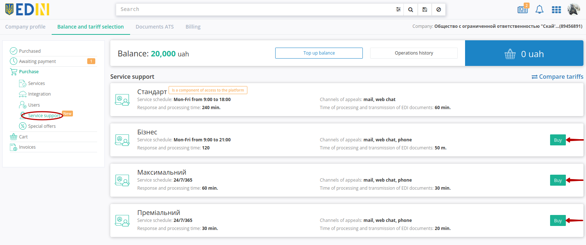
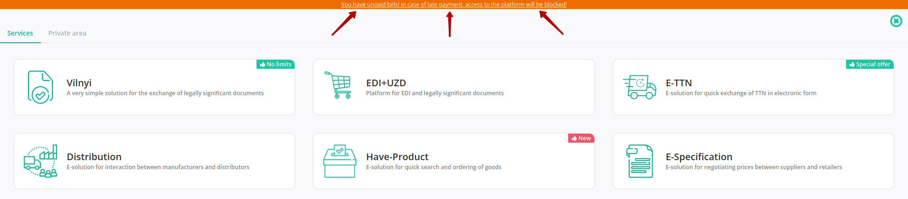
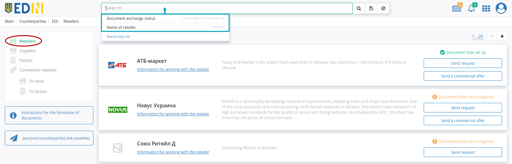
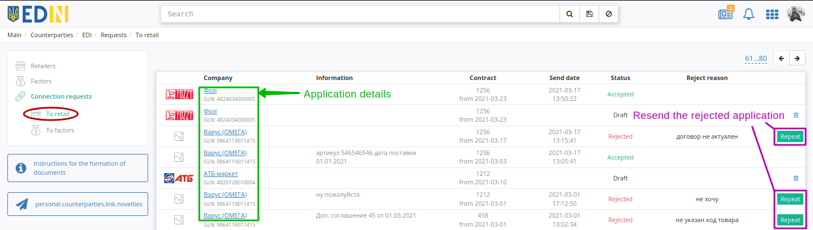

Instruction
#############################################################

.. role:: red

.. role:: orange

.. role:: green

.. role:: underline

.. сюда закину немного картинок для текста

.. |пресуха| image:: pics_PCInstruction/PCInstruction_03.png

.. |red_trash| image:: pics_PCInstruction/PCInstruction_006.png

.. |key| image:: pics_PCInstruction/PCInstruction_134.png

.. |drop_pass| image:: signing/drop_pass.png

.. |del_key| image:: signing/del_key2.png

.. |user| image:: pics_PCInstruction/PCInstruction_178.png

.. |delete| image:: pics_PCInstruction/PCInstruction_179.png

.. |info| image:: pics_PCInstruction/PCInstruction_218.png

.. contents:: Contents:
   :depth: 4

---------

To start working with the **"Private area"** you need to log in to the EDIN 2.0 platform. You can use any browser (latest **Google Chrome** is recommended). You can enter to the platform after following the link https://edo-v2.edin.ua/auth.

When you follow the specified link, the authorization window will open. You must enter your username and password and click **"Sign In"** (`in more details <https://wiki.edin.ua/en/latest/general_2_0/User_registration.html#auth>`__).

After successful authorization, the main menu of EDIN products and solutions will open: **"Vilnyi", "EDI+UZD", "E-TTN", "Distribution", "Have Product", "Commercial offer", "E-Specification", "Counterparties", "Tender", "E-Certificates", "White Doc", "Integration"**:

**"Private area"** section consists of: **"Account"**, **"Settings"** and **"Products"**: 

.. hint::
   You can use the |пресуха| button to return to the services menu.

.. _account:

**1 Account**
================================================

.. hint::
   You can go to the section in two clicks from the user icon:

   .. image:: pics_PCInstruction/PCInstruction_114.png
      :align: center

**"Account"** is a section of the Client's Private area, which is designed to interact with the provider, receive and sign documents from the provider, manage the Personal Account (Balance), select, change and configure tariff packages. **"Account"** contains the following subsections: **"Company profile"**, **"Balance and tariff"**, **"Documents ATS"** and **"Billing"**.

.. note::
   The **"Account"** section is available only to users who use the New Tariff Model. To connect a new tariff model, you need to send an email to sales@edin.ua.

.. _account-profile:

**1.1 Company profile**
----------------------------------

**"Company profile"** contains:

1. Legal data of the company for work with accounts and contracts (these data are partially filled in at `registration at the platform <https://wiki.edin.ua/en/latest/general_2_0/User_registration.html>`__);
2. References to legal sources (**"Additional Information"** block);
3. Contacts for technical support.

On those tab you can add information about the **Director** of the company, edit previously entered **Contacts** of the user and fill in **Addresses**. 

.. hint::
   Required fields are marked with a red asterisk :red:`*`.

In the **"Contacts"** block possible to **"+Add contact"** with the appropriate button:

In the pop-up window you need to select **Contact type** from the drop-down list (financial / commercial / technical / management), specify the contact's name (You may enter manually and **"Apply the entered value"** or select from the list of the `users <https://wiki.edin.ua/en/latest/Personal_Cabinet/PCInstruction.html#users>`__ (with search)), mobile phone number and **"Save"** contact.

Added contacts, if necessary, You can **"Edit"** and **"Delete"**:

.. _balans-tariff:

**1.2 Balance and tariff selection**
--------------------------------------------------

.. raw:: html

   

       <iframe src="https://www.youtube.com/embed/n57CmrfT3VA" frameborder="0" allowfullscreen style="position: absolute; top: 0; left: 0; width: 100%; height: 100%;"></iframe>
   

---------

The functionality of the **"Balance and tariff selection"** tab allows in automatic or semi-automatic mode to purchase access to the services of the electronic document management provider or order the services of the provider company; manage selected services and tariff packages.

The main visual blocks of the tariff constructor are the main menu (1), the panel for work with balance (2) and the journal of services / invoices (3), which changes its appearance depending on the section of the menu in which the user is:

The main menu of **Tariff constructor** consists of:

* **Purchased** - active services / user services with paid access according to the selected tariff package / number of accesses.
* **Awaiting payment** - ordered services which have created invoice (`"Invoices" <https://wiki.edin.ua/en/latest/Personal_Cabinet/PCInstruction.html#invoice>`__ section).
* **Purchase** - available for purchase tariff packages of services / services, conveniently grouped by category:
   * **Services** - available company services;
   * **Integration** - solutions and services for integrated work with the EDIN 2.0 platform from your accounting system;
   * **Users** - connecting additional users to the EDIN 2.0 platform;
   * **Service support** - connection of the increased level of support to the EDIN 2.0 platform;
   * **Special offers** - special offers of the company.
* **Cart** - tariff packages selected for purchase.

**1.2.1 Purchase**
~~~~~~~~~~~~~~~~~~~~~~~~~~~~~~~~~~~~~~~~~~~~~~~~~~~~~~

It is most convenient to get acquainted with the prices for the company's tariff products in the **Purchase** menu section:

For each service brief information is presented with the benefits of its use. You can find out the cost of the service using the **"Buy"** or **""Order"** buttons.

**1.2.1.1 Buying**
""""""""""""""""""""""""""""""""""""""""""""""""""""""

In the open pop-up window you need to select the parameters (period, tariff plan, number of accesses):

The window will automatically display the cost of the service depending on the selected parameters and current promotional discounts at the time of purchase. The selected service can be added to the cart (buttons **"Add to cart and continue shopping"** or **"Add and go to cart"**):

.. image:: pics_New_balance_tariff/New_balance_tariff_08.png
   :align: center

Then in the menu section **"Cart"** a note with the number of selected services is added, and in the upper right corner their total cost is displayed. In the section **"Purchase"** added to **"Cart"** services have the appropriate mark and can be removed from the cart with **"Delete"** button:

**1.2.1.2 Ordering**
""""""""""""""""""""""""""""""""""""""""""""""""""""""

When placing an order (button **"Order"**), in contrast to the buying, it is also possible to specify information on the order (orders do not fall into the **"Cart"**). After sending the application, the company's employees will contact you to discuss the details by phone:

------------------------------------------------

.. hint::
   By default, automatic prolongation of services is activated when selecting a tariff. When the automatic prolongation is activated at the beginning of the month (1 day), the selected tariff package / number of accesses to the service is automatically extended for a similar (previously selected) period of validity under the same conditions. (More details in p.6.6 `Platform Terms of Use <https://wiki.edin.ua/en/latest/Legal_info/Rules.html>`__) 

.. _service-purchase:

**1.2.2 Cart (purchasing the service / license)**
~~~~~~~~~~~~~~~~~~~~~~~~~~~~~~~~~~~~~~~~~~~~~~~~~~~~~~

**"Cart"** displays all services selected for purchase. Go to **"Cart"** is possible through the menu or button with the cost of all selected services:

For each service selected for purchase, its price and discount are indicated; the total cost of all selected services, including discounts and recommended payment, is indicated. If necessary, it is always possible to edit the parameters of selected services (button **"Edit"**) or **"Delete"** from **"Cart"**:

.. hint::
   **"Recommended payment" = Cost of selected tariff + 7%**

   Helps calculate the amount of balance top up to work with selected services and is not required.

.. _serv-buy:

**1.2.2.1 Purchasing the service**
""""""""""""""""""""""""""""""""""""""""""""""""""""""

Purchase of selected services is carried out:

1. If there are enough funds on the balance ("amount on the balance" ⩾ "total amount to be paid") the **"Buy"** button is available:

With the **"Buy"** button the service is purchased with automatic debiting of funds from the balance.

2. If the funds on the balance are not enough ("amount on the balance" < "total amount to be paid") the **"Order"** button is available:

.. _waiting-tariffs:

The **"Order"** button automatically creates an invoice, which is displayed in the menu `"Invoices" <https://wiki.edin.ua/en/latest/Personal_Cabinet/PCInstruction.html#invoice>`__ and ordered services are displayed in the menu **"Awaiting payment"**: 

.. important::
   The invoice for ordered tariff packages that **"Awaiting payment"** is stored for 7 :underline:`working` days, after which unpaid tariff packages are automatically deleted from this section of the menu.

It is possible to make a purchase by paying an invoice (section `"Invoices" <https://wiki.edin.ua/en/latest/Personal_Cabinet/PCInstruction.html#invoice>`__) in a way convenient for you or replenishing the balance (`more details <https://wiki.edin.ua/en/latest/Personal_Cabinet/PCInstruction.html#balance>`__).

.. hint::
   When you purchasing / changing / prolongation a tariff and there are not enough funds on the balance, unlimited access is activated for 2 :underline:`working` days;

   Access is blocked if the invoice is not paid on the 3rd :underline:`working` day (without payment of the "last" invoice access is not provided for another 2 days);

   The block will be removed if there are enough funds on the balance to cover the Additional Transaction / Tariff (after that it is possible to get 2-day access to services before an invoice payment again).

   2 days of loyalty (access) are not activated for invoices issued as part of the automatic prolongation procedure.

.. warning::
   When replenishing the balance, if its amount exceeds the cost of services / services that **"Awaiting payment"**, these funds are debited automatically!

When the total cost of ordered tariff packages exceeds the amount on the balance, but the cost of the service tariff package is less than the amount on the balance, in the section **"Awaiting payment"** it is possible to **"Buy"** the following tariff package:

In the **"Awaiting payment"** section it is possible to find out **"Details"** about tariffs, which will be Bought or **"Delete"** selected tariff packages.

.. hint::
   By default, automatic prolongation of services is activated when selecting a tariff. When the automatic prolongation is activated at the beginning of the month (1 day), the selected tariff package / number of accesses to the service is automatically extended for a similar (previously selected) period of validity under the same conditions. (More details in p.6.6 `Platform Terms of Use <https://wiki.edin.ua/en/latest/Legal_info/Rules.html>`__).

The list of all awaiting payment tariffs can be printed out or downloaded in pdf format:

.. _lic-buy:

**1.2.2.2 Purchasing the license**
""""""""""""""""""""""""""""""""""""""""""""""""""""""

.. attention::
   Purchasing licenses is different from purchasing other company products and services! It is possible to make a purchase through the "Private area" (receipt of the invoice-agreement), but payment of the invoice will be made only by banking in a way convenient for you. That is: funds on the balance in the "Private area" payment in no way (even if the required amount). 

   Tariffs included to special tariffs:

   * Integration module EDI Network (eTTN)
   * Integration module EDI Network (EDI+UZD)
   * Integration module EDI Network ("Vilnyi)

To purchase licenses for the above products, go to **"Cart"**, click **"Buy"** or **"Order"** (in this case, the name of the button depends on the funds on the balance and does not affect the functionality) available special rate:

.. important::
   Payment is made for 1 year of using the integration module, through the generated account-agreement in the menu **"Awaiting payment"** (without the use of funds from the balance)

After "Buying" / "Ordering" of the license, it appears in the main menu of the **"Awaiting payment"** section:

The **"Awaiting payment"** section in this case contains unpaid special services (licenses) and allows you:

* to pay online for the issued bill by using a bank card or in another way (**"Online payment"** button);
* to view/download the created contract invoice (**"Invoice"** button) for further payment through banking institutions (the created invoice-agreement is in the `"Invoices" <https://wiki.edin.ua/en/latest/Personal_Cabinet/PCInstruction.html#invoice>`__ menu section);
* to **"Delete"** position from **"Awaiting payment"** section.

With **"Online payment"** You will be redirected to the page for entering card data or using Google Pay / Apple Pay / Privat24 services or You can pay in **"Another method"**, which is available on this page:

.. _support-buy:

**1.2.2.3 Purchase and continue additional support**
""""""""""""""""""""""""""""""""""""""""""""""""""""""""""""""""""""""""""""""""""""""""""""

The **"Service support"** section presents the possibilities of expanding the basic service support:

.. note::
   Service support **"Standard"** is already a component of platform access.

In **"Service support"** section the basic parameters are described in the tariff packages. To choose the service, it is possible to get acquainted in more detail with the possibilities with **"Compare tariffs"** button:

.. hint::
   When you hover the cursor over the |info| icon a description of the service support parameter is displayed.

It is possible to improve personal service support by choosing an available tariff and **"Buy"** it:

.. note::
   The **"Buy"** service support button is not active if another service support tariff is in the **"Awaiting payment"** section!

In the open pop-up window you need to select the period and the cost of the selected tariff plan will be calculated automatically:

The selected service can be added to Cart (**"Add to cart and continue shopping"** or **"Add and go to cart"** buttons):

.. attention::
   Tariff packages of service support when buying do not use funds from the Balance (even if the required amount is available)!

   .. image:: pics_PCInstruction/PCInstruction_221.png
      :align: center

   Therefore, after clicking **"Buy"** / **"Order"** "Service Support" buttons in the **"Cart"** section funds from the Balance are not written off - an invoice is formed (available in the section `"Invoices" <https://wiki.edin.ua/en/latest/Personal_Cabinet/PCInstruction.html#invoice>`__), and the service itself is displayed in the **"Awaiting payment"** section:

   .. image:: pics_PCInstruction/PCInstruction_222n.png
      :align: center

The **"Awaiting payment"** section in this case contains unpaid services of additional service support and allows you:

* to pay online for the issued bill by using a bank card or in another way (**"Online payment"** button);
* to view/download the created contract invoice (**"Invoice"** button) for further payment through banking institutions (the created invoice-agreement is in the `"Invoices" <https://wiki.edin.ua/en/latest/Personal_Cabinet/PCInstruction.html#invoice>`__ menu section);
* to **"Delete"** position from **"Awaiting payment"** section.

With **"Online payment"** You will be redirected to the page for entering card data or using Google Pay / Apple Pay / Privat24 services or You can pay in **"Another method"**, which is available on this page:

--------------------------------------------------------------------------

.. note::
   **"Prolong"** service support button is not active if another service support tariff is in the section **"Awaiting payment"**!

The functionality of extending the tariff package is described in `"Prolong the tariff package" <https://wiki.edin.ua/en/latest/Personal_Cabinet/PCInstruction.html#continue-tariff>`__ section.

**1.2.3 Add / Prolong / Edit the tariff package of the purchased service**
~~~~~~~~~~~~~~~~~~~~~~~~~~~~~~~~~~~~~~~~~~~~~~~~~~~~~~~~~~~~~~~~~~~~~~~~~~~~~~~~~~~~~~~~~~~~~~~~~~~~~~~~~~~~

The **"Purchased"** section displays all paid active services with information on their availability period, selected tariff, balance or quantity (options) for the current and other months (**"Details"** button):

If you click on the used transactions you will be redirected to `"Billing" <https://wiki.edin.ua/en/latest/Personal_Cabinet/PCInstruction.html#billing>`__ tab:

.. _purchase-tariff: 

**1.2.3.1 Add the tariff package**
""""""""""""""""""""""""""""""""""""""""""""""""""""""

With the **"Add"** button it is possible to buy (add any additional) tariff package to :underline:`current month`:

The purchase of an additional tariff package is carried out through **"Cart"** (more details in `Cart <https://wiki.edin.ua/uk/latest/Personal_Cabinet/PCInstruction.html#service-purchase>`__):

.. hint::
   When you purchasing / changing / prolongation a tariff and there are not enough funds on the balance, unlimited access is activated for 2 :underline:`working` days;

   Access is blocked if the invoice is not paid on the 3rd :underline:`working` day (without payment of the "last" invoice access is not provided for another 2 days);

   The block will be removed if there are enough funds on the balance to cover the Additional Transaction / Tariff (after that it is possible to get 2-day access to services before an invoice payment again).

   2 days of loyalty (access) are not activated for invoices issued as part of the automatic prolongation procedure.

.. _continue-tariff:

**1.2.3.2 Prolong the tariff package**
""""""""""""""""""""""""""""""""""""""""""""""""""""""

With the **"Prolong"** button it is possible to prolong :underline:`basic tariff` [1]_ according to the tariff package for the current month (add the same tariff (without changing the number of options) for the new period):

.. important::
   The **"Prolong"** function is not available for :underline:`annual tariff` [2]_, which are already paid for more than 12 months.

Prolongation of the tariff package is carried out through **"Cart"** (more details in `Cart <https://wiki.edin.ua/uk/latest/Personal_Cabinet/PCInstruction.html#service-purchase>`__):

.. hint::
   When you purchasing / changing / prolongation a tariff and there are not enough funds on the balance, unlimited access is activated for 2 :underline:`working` days;

   Access is blocked if the invoice is not paid on the 3rd :underline:`working` day (without payment of the "last" invoice access is not provided for another 2 days);

   The block will be removed if there are enough funds on the balance to cover the Additional Transaction / Tariff (after that it is possible to get 2-day access to services before an invoice payment again).

   2 days of loyalty (access) are not activated for invoices issued as part of the automatic prolongation procedure.

**1.2.3.3 Edit the tariff package**
""""""""""""""""""""""""""""""""""""""""""""""""""""""

With the **"Edit"** button it is possible to make a change :underline:`basic tariff` [1]_ in the selected period (only in the direction of tariff increase):

.. note::
   A change in the tariff package means a change in the paid service options (s). In case of change, the amount to be paid taking into account the previously paid tariff package is calculated. To change the tariff for reduction, please contact the responsible manager and / or send a letter to sales@edin.ua (more details in p.6.3 `Platform Terms of Use <https://wiki.edin.ua/en/latest/Legal_info/Rules.html>`__).

Changing the tariff package of the service is carried out through **"Cart"** (more details in `Cart <https://wiki.edin.ua/uk/latest/Personal_Cabinet/PCInstruction.html#service-purchase>`__):

.. hint::
   When you purchasing / changing / prolongation a tariff and there are not enough funds on the balance, unlimited access is activated for 2 :underline:`working` days;

   Access is blocked if the invoice is not paid on the 3rd :underline:`working` day (without payment of the "last" invoice access is not provided for another 2 days);

   The block will be removed if there are enough funds on the balance to cover the Additional Transaction / Tariff (after that it is possible to get 2-day access to services before an invoice payment again).

   2 days of loyalty (access) are not activated for invoices issued as part of the automatic prolongation procedure.

.. _balance:

**1.2.4 Balance top up**
~~~~~~~~~~~~~~~~~~~~~~~~~~~~~~~~~~~~~~~~~~~~~~~~~~~~~~

The balance panel displays the current balance (available for purchases of tariff packages or services of the electronic document management provider):

For **"Balance top up"** you need to specify the amount of replenishment (uah) and choose the method: **"Online payment"** (LiqPay) or **"Create invoice"**:

.. tabs::

   .. tab:: Online payment

      With **"Online payment"** You will be redirected to the page for entering card data or using Google Pay / Apple Pay / Privat24 services or You can pay in **"Another method"**, which is available on this page:

      .. image:: pics_PCInstruction/PCInstruction_258.png
         :align: center

   .. tab:: Create invoice

      When You **"Create invoice"** the system automatically creates an invoice (more details in `"Invoices" <https://wiki.edin.ua/en/latest/Personal_Cabinet/PCInstruction.html#invoice>`__):

      .. image:: pics_PCInstruction/PCInstruction_008.png
         :align: center

      .. hint::
         When you create an invoice, it is also automatically sent to email.

**"History of transactions"** (has a convenient search) is kept for all transactions with the balance:

.. _invoice:

**1.2.5 Invoices**
~~~~~~~~~~~~~~~~~~~~~~~~~~~~~~~~~~~~~~~~~~~~~~~~~~~~~~

The WEB platform will always remind you if you have unpaid invoices and helps you view them in one click (the text is a link to the Invoices):

.. attention::
   The cost of services of the provider company is fixed in euro currency and at the time of formation of the invoice amount the value is converted into hryvnia equivalent according to the exchange rate for the current day. Accounting:
   
   1) **After ordering** (**"Order"** button in Cart) the invoice amount is fixed for 7 working (non-calendar) days. On the eighth working day, the unpaid invoice is considered canceled. When paying an invoice after the eighth day and later, the funds are transferred to the Balance. To activate the service, you need to select and **"Buy"** the service again (the cost of the tariff will be recalculated according to the new exchange rate).
   
   2) **When invoice creates with auto-prolongation** (1st working day of the month) at the rate on this day an invoice is kept until the end of the month. An additional inspection is performed daily 5 working days before the end of the month. In case of absence of the activated tariff package for the next month and in the absence of selected but not yet activated tariff packages for the next month at the time of inspection - an invoice for auto-prolongation valid for 7 working days is formed.

In **"Invoices"** section documents are marked in different colors depending on the status [3]_ (:red:`Unpaid` / :green:`Paid` / :orange:`Partial payment`) with the specified amount, the amount with recommended payment / recommended payment only (7% of the amount):

Print functionality is available in the journal (|друк|) as download the document in pdf format (|pdf|) and the opportunity to request the original (|карандаш|) paid invoice.

With the left mouse button you can select an invoice to view its contents:

With the button **"Report by period"** it is possible to get an Excel-report with details on tariff packages included in the act of work performed by the АТС for the selected period:

The report displays detailed information by amounts and dates, divided into blocks "Top up in the selected period", "Debit in the selected period", "Used with period":

.. hint::
   Realized sending of Excel-report with details on acts of performed works from "АТС" on the 6th working day of the current month for the last month by email for invoices (`company profile <https://wiki.edin.ua/en/latest/Personal_Cabinet/PCInstruction.html#account-profile>`__ -> contacts -> email field for invoices):

   .. image:: pics_PCInstruction/PCInstruction_131.png
      :align: center

----------------------------------

.. _docs:

**1.3 АТС documents**
----------------------------------

The WEB platform will always remind you if you have unpaid invoices and help you view them in one click (the text is a link to the **"Documents ATS"** subsection):

The functionality of the **"Documents ATS"** tab  allows you to exchange documents (acts, invoices) with the АТС company-provider; to receive electronic document exchange services. Tab is divided into two main blocks: folders (1) and document journal (2):

#. The "Inbox" folder contains all incoming documents from the company-provider for further signing ("Services Acceptance Certificate" (`COMDOC_018 <https://wiki.edin.ua/uk/latest/XML/XML-structure.html#comdoc-018>`__) and "Tax Invoice" (`DECLAR <https://wiki.edin.ua/uk/latest/XML/XML-structure.html#declar>`__)).
#. The "Outbox" folder contains all the documents sent to the provider company.
#. The "Archive" folder contains all archived and processed documents that have been transferred to the archive.
#. The "Invoices" folder contains invoices from the provider company for timely payment of access.
#. "Contracts / AA with QES" folder contains files of contracts / additional agreements with QES (qualified electronic signature).
#. Filters of documents by date (**"Today"**, **"Yesterday"**) are made separately, and the last entered search is saved by the platform automatically and when you press the button **"Last filter"** it is performed again in that folder ( "Inbox" / "Outbox" / "Archive" / "Invoices" / "Contracts / AA with QES"), in which it was last performed (you will be redirected).

.. _invoice:

**1.3.1 Invoices**
~~~~~~~~~~~~~~~~~~~~~~~~~~~~~~~~~~~~~~~~~~~~~~~~~~~~~~

.. attention::
   The cost of services of the provider company is fixed in euro currency and at the time of formation of the invoice amount the value is converted into hryvnia equivalent according to the exchange rate for the current day. Accounting:
   
   1) **After ordering** (**"Order"** button in Cart) the invoice amount is fixed for 7 working (non-calendar) days. On the eighth working day, the unpaid invoice is considered canceled. When paying an invoice after the eighth day and later, the funds are transferred to the Balance. To activate the service, you need to select and **"Buy"** the service again (the cost of the tariff will be recalculated according to the new exchange rate).
   
   2) **When invoice creates with auto-prolongation** (1st working day of the month) at the rate on this day an invoice is kept until the end of the month. An additional inspection is performed daily 5 working days before the end of the month. In case of absence of the activated tariff package for the next month and in the absence of selected but not yet activated tariff packages for the next month at the time of inspection - an invoice for auto-prolongation valid for 7 working days is formed.

In **"Invoices"** documents are marked in different colors depending on the status [3]_ (:red:`Unpaid` / :green:`Paid` / :orange:`Partial payment`) with the specified amount, the amount with recommended payment / recommended payment only (7% of the amount):

Print functionality is available in the journal (|друк|) as download the document in pdf format (|pdf|) and the opportunity to request the original (|карандаш|) paid invoice.

With the left mouse button you can select an invoice to view its contents:

With the button **"Report by period"** it is possible to get an Excel-report with details on tariff packages included in the act of work performed by the АТС for the selected period:

In the modal window you need to select the interval, after which the report can be **"Download to Excel"**. The report can be generated in increments of one month, with a total interval of no more than 1 year.

.. _contracts-kep:

**1.3.2 Contracts / AA with QES**
~~~~~~~~~~~~~~~~~~~~~~~~~~~~~~~~~~~~~~~~~~~~~~~~~~~~~~

The catalog **"Contracts / AA with QES"** displays Contracts / AA, initiated or sent by you or the АТС company. The document log displays brief information (document direction (incoming / outgoing), document type, status, document date, АТС signing mark):

Possible document statuses:

* **Sent** - the new document is awaiting approval by the counterparty 
* **Provider signature required** - the document you agreed upon has been sent
* **Signed** - the document is signed by both parties
* **Rejected** - the document is rejected

**1.3.2.1 Work with incoming documents from АТС**
""""""""""""""""""""""""""""""""""""""""""""""""""""""""""""""""""""""""

To view detailed information about the document, click on **"File name"**. Then the form with information about the document opens. This is how the new input document will look like:

In the open form of a new incoming document possible to:

* **"Download PDF"** - get a file to view its contents;
* **"Sign"** - sign АТС document;
* **"Reject"** - reject АТС document.

To sign the contract you need to click on the **"Sign"** button.

.. _sign:

**1.3.2.1.1 Sign document**
++++++++++++++++++++++++++++++++++++++++++++++++++++

.. загальне підписання на платформі

.. include:: /_constant/signing/signing.rst
   :start-after: .. початок блоку для Signing
   :end-before: .. кінець блоку для Signing

After signing the document, its status changes to **"Provider signature required"**, and when viewing detailed information, information about the signatories is additionally displayed:

After signing it is possible to **"Print"** and **"Download .p7s"**. A watermark is added to the printed form of the document (pdf) in the upper left corner of each page of the file, as well as the page of the signature letter:

.. image:: pics_PCInstruction/PCInstruction_106.png
   :align: center

The watermark contains information that the file was signed at EDI Network, GUID of the document.

The signing letter contains information about the document and its signatories.

After the document is signed by the АТС, the document changes its status to **"Signed"**, and when viewing detailed information, information about all signatories is displayed:

.. image:: pics_PCInstruction/PCInstruction_109.png
   :align: center

**1.3.2.1.2 Document rejection**
++++++++++++++++++++++++++++++++++++++++++++++++++++

To reject the contract, click on the **"Reject"** button. Then in the "Comment" window you must fill in the reason for canceling the document and confirm with **"Cancel"** button:

.. image:: pics_PCInstruction/PCInstruction_76.png
   :align: center

.. _send-doc-to-ats:

**1.3.2.2 Sending documents to the provider (to LLC "АТС")**
""""""""""""""""""""""""""""""""""""""""""""""""""""""""""""""""""""""""

It is possible to send documents in the form of pdf files (not more than 5 MB) to the provider of electronic document management (to LLC "АТС") using the **"Send document to provider"** button:

In the modal window before **"Send"** document you need to select a pdf file (button **"Choose file"**), specify the type of document (requires / does not require signing by the provider LLC "АТС") and the title of the document (maximum 100 characters):

Sending a document requires its signing (signing is a standard operation on the platform, `described in the section above <https://wiki.edin.ua/en/latest/Personal_Cabinet/PCInstruction.html#sign>`__. After successful signing of the document, it is automatically sent to the "АТС" LLC and displayed in the journal with the status **Sent** or **Provider signature required** (if the value "Requires a signature by the provider Ltd "АТС"" was selected):

.. _act-request:

**1.3.3 Request for the Act**
~~~~~~~~~~~~~~~~~~~~~~~~~~~~~~~~~~~~~~~~~~~~~~~~~~~~~~

The functionality is available in the **Inbox** folder and allows You to make a **"Request for the Act"** to "ATS" LLC directly from the platform:

After clicking on the **"Request for the Act"** button, a modal window opens with mandatory fields: "Document type" (Act / Act of reconciliation), "Your e-mail", "Description of the request" . After you enter the request data, it is possible to **"Send a request"** to ATS LLC. You will be informed about the successful sending of the request by a notification on the platform:

Primary documents from LLC "ATS" are created in electronic form with the signing of the QES - you will receive them in the **Inbox** folder. Additionally (if necessary), an explanation and a copy of the document can be sent to the specified e-mail address.

.. _billing:

**1.4 Billing**
----------------------------------

**"Billing"** tab allows you to track and control billing (document traffic):

The date / time of billing entry, document type, sender, recipient, document number is displayed. With the help of filters it is possible to make a sample by:

* time period (year, month)
* status (incoming / outgoing) of the document
* document type
* connected network-counterparty

The list generated by filtering you may **"Download"** to your media in xlsx format.

.. _settings:

.. поки без перекладу

               **2 Налаштування**
               ================================================

.. _counterparties: 

**3 Counterparties**
================================================

The **Counterparties** section allows the user to configure and improve the interaction with the platform's services and counterparties.

**3.1 EDI**
----------------------------------

The service allows you to set up interaction with retail chains by generating connection requests.

**3.1.1 Suppliers (paragraph for Retailers)**
~~~~~~~~~~~~~~~~~~~~~~~~~~~~~~~~~~~~~~~~~~~~~~~~~~~~~~

**Suppliers** - subdivision with the list of Suppliers connected to the Retailer. Contains the name of the company, logo, USREOU / TIN, by which it is possible to sort the list:

**3.1.2 Retailers (paragraph for Suppliers/Factors)**
~~~~~~~~~~~~~~~~~~~~~~~~~~~~~~~~~~~~~~~~~~~~~~~~~~~~~~~~~~~~~~~~~~~~~~~~~~

**Retailers** - a section with a list of networks that accept connection requests. 

The list can be sorted by document status (:orange:`Document flow not configured`, :green:`Document flow set up`), search by part of the name:

The list displays the network name, logo, additional information, document status and:

* connection request generation functionality - **"Send request"** (in addition there is **"Instructions for the formation of documents"**);
* functionality of sending commercial offers - **"Send a commercial offer"** (it is possible to go to the service using the button of the same name **"Commercial offers"**);

.. note::
   The offer creation functionality is available only with enabled `access <https://wiki.edin.ua/uk/latest/Personal_Cabinet/PCInstruction.html#user-roles>`__ for **"Commercial offers"** service!

The same steps can be performed inside Retail card. Retail card displays contact information, a list of connected documents and services:

**3.1.2.1 Connection request to Retail**
""""""""""""""""""""""""""""""""""""""""""""""""""""""""""""""

When creating a connection request, the application form opens (required fields are marked with a red asterisk :red:`*`). Once the required fields are filled it is possible to **"Generate a request"**:

For security reasons and correct identification of the Supplier, the application is sent only after the electronic digital signature of the Sender is applied (the USREOU of the key must correspond to the USREOU specified in the GLN).

.. hint::
   The signing process is typical for the platform and is described in the `section above <https://wiki.edin.ua/en/latest/Personal_Cabinet/PCInstruction.html#sign>`__. If the USREOU of the key coincides with the USREOU of the account, the account is automatically "confirmed".

However, signing during the request is not required if you select a GLN that has already been `confirmed with QES <https://wiki.edin.ua/uk/latest/Personal_Cabinet/PCInstruction.html#gln>`__:

Then a Retail request (as a draft) is generated for preview. Before you **"Send request"** you may **"Download PDF of the application"** and add additional unsigned files to Retail (**"+Upload files"**):

.. image:: pics_PCInstruction/PCInstruction_152.png
   :align: center

.. note::
   It is possible to add to the request txt, .doc, .docx, .xls, .xlsx, .ppt, .pptx, image, .pdf, .rtf, .zip files up to 5 MB in size and up to 10 MB in total. The system specifies the size of the attached files and calculates the available size for upload, as a hint:

   .. image:: pics_PCInstruction/PCInstruction_124.png
      :align: center

In the "Files list" block all files can be downloaded, and additional can be deleted:

After the actions with the files are performed, you need to **"Send request"**:

The submitted request changes its status to :orange:`Under consideration` and displayed in **"Connection requests"** to the Retail:

After the Retail *confirms* or *rejects* the request, the Supplier will get an Email message and the request status will be updated (more details in `Connection requests <https://wiki.edin.ua/en/latest/Personal_Cabinet/PCInstruction.html#request>`__).

.. _factor: 

**3.1.3 Factors (paragraph for Supplier/Retail)**
~~~~~~~~~~~~~~~~~~~~~~~~~~~~~~~~~~~~~~~~~~~~~~~~~~~~~~

Functionality allows you to organize work between contractors through factoring. To get started, you need to choose a factor (for convenience, you can use `search <https://wiki.edin.ua/uk/latest/general_2_0/rabota_s_platformoj_EDIN_2.0.html#doc-search>`__) and create a **"Factoring application"** by clicking on the appropriate button:

Then you need to fill in **Factoring application** (required fields are marked with a red asterisk :red:`*`):

When entering the data of the debtor you need to start entering its name or GLN (from three characters) and the system itself will ask you to select a value from the list:

.. image:: pics_PCInstruction/PCInstruction_209.gif
   :align: center

It is possible to add an unlimited number of debtors (at least one) using the button **"+ Add a debtor"**, and if necessary **"Delete"** added debtors:

It is possible to add a text note in the **Additional information** block. 

.. note:: The **Factor fills in data** block is filled in only by the factoring company!

After all the required fields are filled in, it is possible to **"Generate an application"** or **"Save draft"** for further editing:

.. image:: pics_PCInstruction/PCInstruction_194.png
   :align: center

For security reasons and correct identification Supplier / Retail application is sent only after `confirmation of GLN <https://wiki.edin.ua/uk/latest/Personal_Cabinet/PCInstruction.html#gln>`__ of a Sender (USREOU in QES must comply with USREOU specified in GLN).

.. hint::
   The signing process is typical for the platform and is described in the `section above <https://wiki.edin.ua/en/latest/Personal_Cabinet/PCInstruction.html#sign>`__. If the USREOU of the key coincides with the USREOU of the account, the account is automatically "confirmed".

However, signing during the request is not required if you select a GLN that has already been `confirmed with QES <https://wiki.edin.ua/uk/latest/Personal_Cabinet/PCInstruction.html#gln>`__:

Then a Factor request (as a draft) is generated for preview. Before you **"Send request"** you may **"Download PDF of the application"** and add additional unsigned files to Factor (**"+Upload files"**):

.. note::
   It is possible to add to the request txt, .doc, .docx, .xls, .xlsx, .ppt, .pptx, image, .pdf, .rtf, .zip files up to 5 MB in size and up to 10 MB in total. The system specifies the size of the attached files and calculates the available size for upload, as a hint:

   .. image:: pics_PCInstruction/PCInstruction_124.png
      :align: center

In the "Files list" block all files can be downloaded, and additional can be deleted:

.. image:: pics_PCInstruction/PCInstruction_191.png
   :align: center

After the actions with the files are performed, you need to **"Send request"**:

The submitted request changes its status to :orange:`Under consideration` and displayed in **"Connection requests"** to the Factors:

After the Factors *confirms* or *rejects* the request, the Supplier / Retail will get an Email message and the request status will be updated (more details in `Connection requests <https://wiki.edin.ua/en/latest/Personal_Cabinet/PCInstruction.html#request>`__).

.. _request: 

**3.1.4 Connection requests**
~~~~~~~~~~~~~~~~~~~~~~~~~~~~~~~~~~~~~~~~~~~~~~~~~~~~~~

The **Connection requests** section is divided into **Requests to Retail** and **Requests to Factors**:

.. important::
   * The **Requests to Retail** section for the Supplier / Factor and Retail roles is functionally different, as the Supplier / Factor is the sender and the Retail is the recipient which make decision.
   * The **Requests to Factors** section for the Supplier / Retail and Factor roles is functionally different, as the Supplier / Retail is the sender and the Factor is the recipient which make decision.

Status of requests:

* Draft (can be deleted |мусорка|) - created by Supplier but not sent connection request;
* :red:`Rejected` - Retail rejected the connection request;
* :green:`Accepted` - Retail accepted the connection request;
* :orange:`Under consideration` - a request has been sent and Retail has not made a decision on yet.

The list can be sorted by status:

**3.1.4.1 Connection requests to Retail (paragraph for Supplier/Factor)**
""""""""""""""""""""""""""""""""""""""""""""""""""""""""""""""""""""""""""""""""""""""""

**Requests to Retail** - section of all sent requests of this user. The list displays the Retail name, logo, GLN, additional information, connection agreement, application status.

You can read more about the connection request by clicking on the network name; **"Repeat"** button is available only when the request was rejected and resends the connection request (forming a new request is similar to the functionality **"Send request"**).

When viewing the connection request in more detail, the status is displayed (for the rejected request, the reason for the rejection is additionally indicated), the form with the data sent during the request formation:

**3.1.4.2 Connection requests to Retail (paragraph for Retail)**
""""""""""""""""""""""""""""""""""""""""""""""""""""""""""""""""""""""""""""""""""""""""""

**Requests to Retail** - section of all received requests by the Retail. The list displays the name of the signatory, logo, GLN, additional information, connection agreement, sending date, application status, reason for rejection. You can get acquainted with the connection request in more detail by clicking on the name of the sender of the request:

.. hint::
   Requests on which decisions have already been made (in :green:`Accepted` / :red:`Rejected` statuses) on the Supplier / Factor and the Retail side are same.

If the request is in :orange:`Under consideration` status, then on the Retail side there are active decision-making buttons: **"Confirm"** and **"Reject"** (rejection requires the reason):

According to all applications with :orange:`Under consideration` status Retail will receive every Monday at 10:00 a reminder letter to the contact email:

.. image:: pics_PCInstruction/PCInstruction_164.png
   :align: center

Once the decision is made, the request changes its status to :green:`Accepted` / :red:`Rejected`.

.. note::
   In addition, for all requests from the Supplier, the Retail receives a letter with a link to the decision form, which does not require authorization (the letter also contains a signed application in pdf format):

   .. image:: pics_PCInstruction/PCInstruction_100.png
      :align: center

   .. image:: pics_PCInstruction/PCInstruction_101.png
      :align: center

   *In case of rejection, the reason for refusal must be indicated*:

   .. image:: pics_PCInstruction/PCInstruction_102.png
      :align: center

**3.1.4.3 Connection requests to Factors (paragraph for Supplier/Retail)**
""""""""""""""""""""""""""""""""""""""""""""""""""""""""""""""""""""""""""""""""""

**Requests to Factors** - section of all sent requests of this user. The list shows the name of the factoring company, logo, GLN, additional information, factoring agreement, shipping date, application status, reason for rejection. It is possible to get acquainted with the application for factoring in more detail by clicking on the name of the factoring company; **"Repeat"** button is available only when the request was rejected and resends the connection request (forming a new request is similar to the functionality **"Send request"**).

When viewing the connection request in more detail, the status is displayed (for the rejected request, the reason for the rejection is additionally indicated), the form with the data sent during the request formation:

**3.1.4.4 Connection requests to Factors (paragraph for Factors)**
""""""""""""""""""""""""""""""""""""""""""""""""""""""""""""""""""""""""""

Factor receives an email with a link to the application, the application in PDF form and the original attachments (if any):

.. image:: pics_PCInstruction/PCInstruction_198.png
   :align: center

**Requests to Factors** - section of all received requests by the Factor. The list displays the name of the signatory, logo, GLN, additional information, factoring agreement, sending date, application status, reason for rejection. It is possible to get acquainted with the request for factoring in more detail by clicking on the name of the sender of the request:

.. image:: pics_PCInstruction/PCInstruction_204.png
   :align: center

.. hint::
   Requests on which decisions have already been made (in :green:`Accepted` / :red:`Rejected` statuses) on the Supplier / Retail and the Factor side are same.

If the request is in :orange:`Under consideration` status, then on the Factor side there are active decision-making buttons: **"Confirm"** and **"Reject"**:

Before **"Confirm"** the application, it is possible to specify the bank details (bank name, current account, MFI) that will be displayed to the Supplier / Retail:

In case of rejection, the reason must be filled in (in text form):

Supplier / Retail receives a letter with a notification about the change of the status of the application and a link to it:

-------------------------------------

.. [#] **Basic tariff** - tariff package of the service that was purchased for the first time for the selected period.
   
.. [#] **Annual tariff** - tariff package that is purchased for a period of one year, for example, "E-Certificates".

.. [#] The status of invoices is set by the provider company.  

-------------------------------------

.. include:: /_constant/kontakti.rst
