########################################################################################################################
"International transportation" document flow with the "ATB" network on the EDI Network 2.0 platform
########################################################################################################################

.. сюда закину немного картинок для текста

.. |loupe| image:: pics_ATB_International_transportation_instruction/ATB_International_transportation_instruction_003.png

.. |house| image:: pics_ATB_International_transportation_instruction/ATB_International_transportation_instruction_004.png

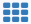

.. role:: red

.. contents:: Contents:
   :depth: 2

---------

.. new part for eng only

Login to the platform
====================================

When you follow the specified link, the authorization window will open. You must enter your username and password and click "Login" as shown in the image below: 

.. image:: pics_ATB_International_transportation_instruction/ATB_International_transportation_instruction_040.png
   :align: center

You can easily change to one of possible platform languages:

.. image:: pics_ATB_International_transportation_instruction/ATB_International_transportation_instruction_041.png
   :align: center

After successful authorization, the main menu (|press|) for selecting the EDIN platform service will open: **"Vilnyi", "EDI+UZD", "E-TTN", "Producer", "Distributor", "E-Certificates", "E-Specification", "Commercial offers", "Products", "DOCflow", "Tender", "Wiki" **. Choose the "EDI+UZD":

.. image:: pics_ATB_International_transportation_instruction/ATB_International_transportation_instruction_039.png
   :align: center

Introduction
====================================

This instruction describes the document flow procedure with the ATB network on the EDI Network 2.0 platform according to the scheme provided for international transportation. In the document flow involved the following documents: 

- `Purchase Order <https://wiki.edin.ua/uk/latest/XML/XML-structure.html#order>`__
- `Purchase Order Response <https://wiki.edin.ua/uk/latest/XML/XML-structure.html#ordrsp>`__
- `Despatch Advice <https://wiki.edin.ua/uk/latest/XML/XML-structure.html#desadv>`__
- `Universal document <https://wiki.edin.ua/uk/latest/XML/XML-structure.html#condra>`__

General scheme of document flow:

.. uml::
   :scale: 100 %
   :align: center

   @startuml

   ATB -> Supplier: Purchase Order (ORDER)
   ATB <- Supplier: Purchase Order Response (ORDRSP)
   ATB <- Supplier: Despatch Advice (DESADV)
   ATB <- Supplier: Universal document (CONDRA)
   ATB -> Supplier: Universal document (CONDRA)

   @enduml

1 "Purchase Order" (ORDER) document formation. The "ATB" network side
==================================================================

To form an "Purchase Order" (ORDER), the user of the "ATB" network in the service menu must click **"Create"** and select the document "Purchase Order" (for convenience, You can use the search by document name):

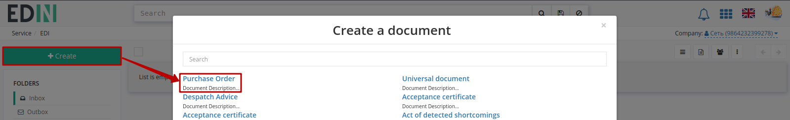

In the open form of the document, all required fields are marked with a red asterisk :red:`*`.

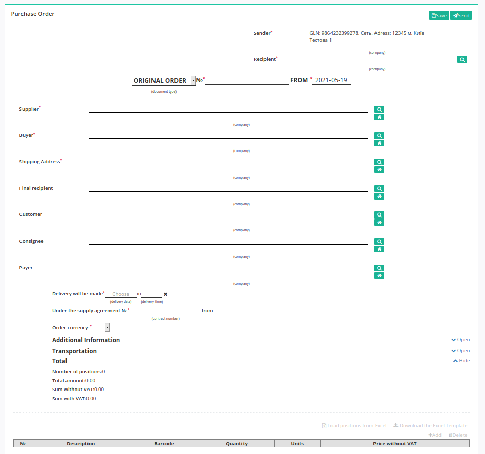

#. **Sender** - sender data (network) are filled in automatically; not editable; 
#. **Recipient** - recipient data (Supplier), for convenient search of the counterparty press the button with a magnifying loupe icon |loupe| ;
#. **Document type** - field for selecting the type: *Original order*, *Replacement*, *Remove*, *Fictitious order*, *Preorder*, *Service order*;
#. **№** - Order number;
#. **from** - confirmation date, the current date is specified by default;
#. **Supplier** - filled in with the "Search for a counterparty" button (|loupe|) or with the "Specify yourself" button (|house|);
#. **Buyer** - filled in with the "Search for a counterparty" button (|loupe|) or with the "Specify yourself" button (|house|);
#. **Shipping Address** - filled in with the "Search for a counterparty" button (|loupe|) or with the "Specify yourself" button (|house|);
#. **Delivery will be made** - date and time of delivery;
#. **Under the supply agreement №** - delivery contract number;
#. **Order currency** - EUR / UAH / USD.

.. hint::
   It is possible to specify or change the Buyer or Supplier data by using the **"Search for a counterparty"** button (|loupe|) or using the **"Specify yourself"** button (|house|). Enter a company name, GLN, or TIN for searching:

   .. image:: pics_ATB_International_transportation_instruction/ATB_International_transportation_instruction_005.png
      :align: center

.. вирішили прибрати, але для інших інструкцій ок - Блоки **Додаткова інформація** та **Транспортування** необов'язкові для заповнення і "згорнуті" за замовчуванням. Блок **Разом** розраховується автоматично після заповнення позицій.

   .. image:: pics_ATB_International_transportation_instruction/ATB_International_transportation_instruction_006.png
      :align: center

The tabular part displays the basic information on the ordered **product items**. Items can be filled in manually (button **"+Add"**) or **"Load items from Excel"** file.

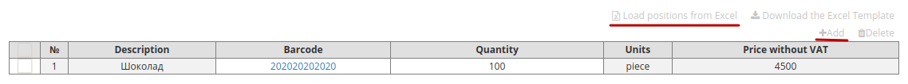

When you insert data manually via the ** "+Add"** button, the product items are filled in from the product directory (all required fields are marked with a red asterisk :red:`*`):

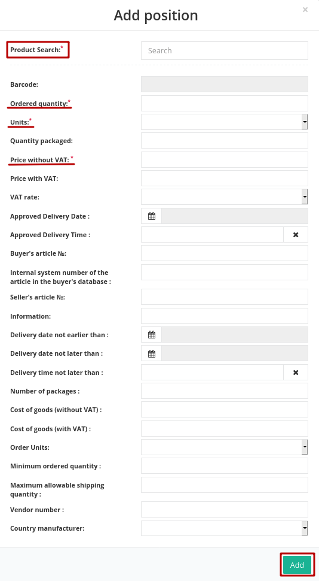

It is possible to load items by list using an Excel .XLS file. You can use a template to fill in the table correctly (button **"Download the Excel Template"** to download the template in .xls format). Open and fill in the Excel file. Columns highlighted in green are **required**! Some columns have tooltips (move the cursor to the top corner of the column name to display the tooltip):

.. image:: pics_ATB_International_transportation_instruction/ATB_International_transportation_instruction_009.png
   :align: center

To upload the completed file to the platform, click on the **"Load positions from Excel"** button and select the saved file in a new window.

If you need to change or supplement position data, change the data in the .XLS file and reload file to the platform. Items will update according to the file.

.. important:: If You wrong fill in the .XLS Excel file, You will receive an error message with correcting instructions. When you add an item that has been already added, a warning will also appear.

After you insert all data you need to **"Save"** (1) the document. Only after that **"Send"** (2) become possible: 

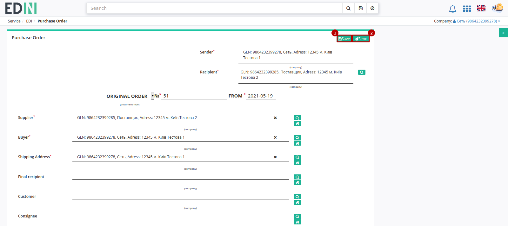

After saving the document gets to the **"Drafts"** folder:

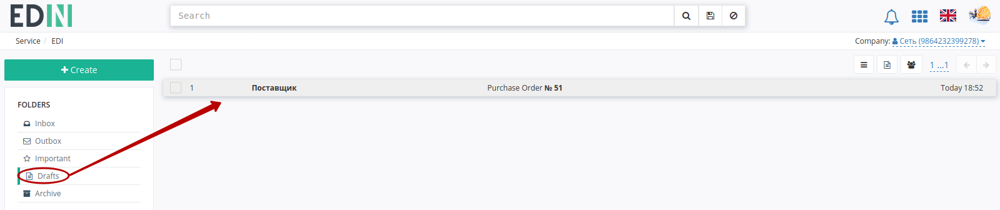

The sent document automatically gets to the **Outbox** folder:

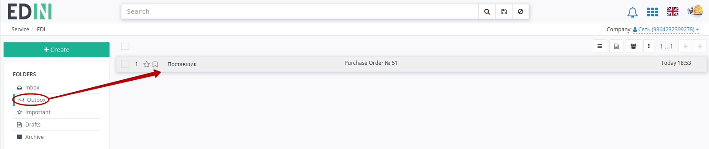

On the sent "Purchase Order" form you can print document and replace this "Purchase Order" with *New*. Also is possible to leave a comment that will be displayed to the counterparty at the "Purchase Order" form:

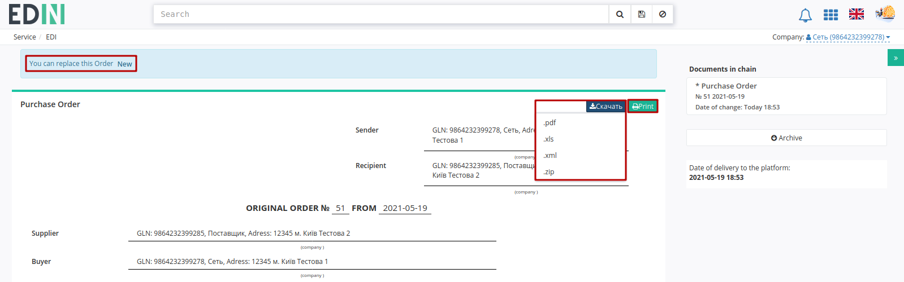

2 An "Purchase Order Response" (ORDRSP) formation in response to an incoming "Purchase Order" (ORDER). The Supplier side
=========================================================================================================================

To generate an "Purchase Order Response" (ORDRSP), select "Purchase Order" (ORDER) which you want to confirm in the **"Inbox"** folder. To search, simply enter the correct document number in the "Search" field. Documents can also be searched by **Sender**, **Document Date** and **Recipient**.

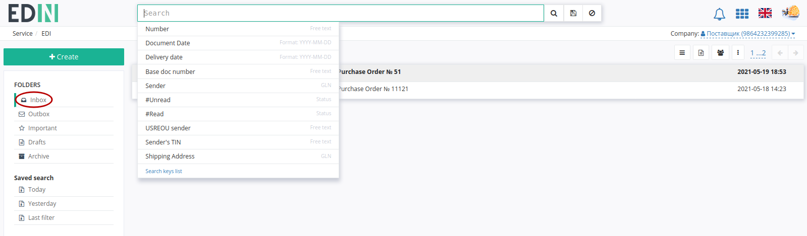

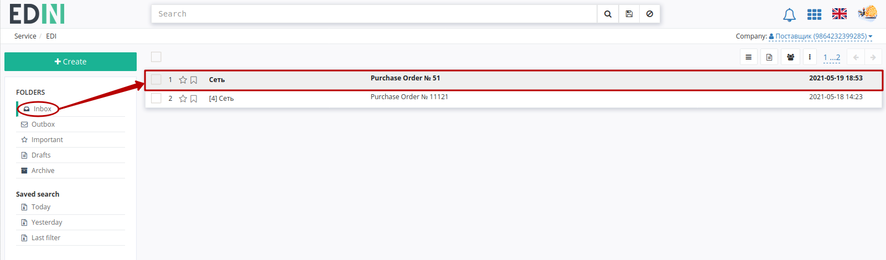

To create an "Purchase Order Response" (ORDRSP), select the appropriate document on the hint form - the document will be created automatically.

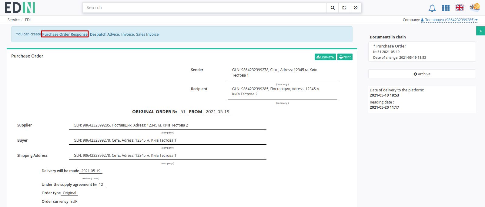

In the open "Purchase Order Response" form (ORDRSP) some fields are filled in automatically from the associated "Purchase Order" (all required fields are marked with a red asterisk :red:`*`):

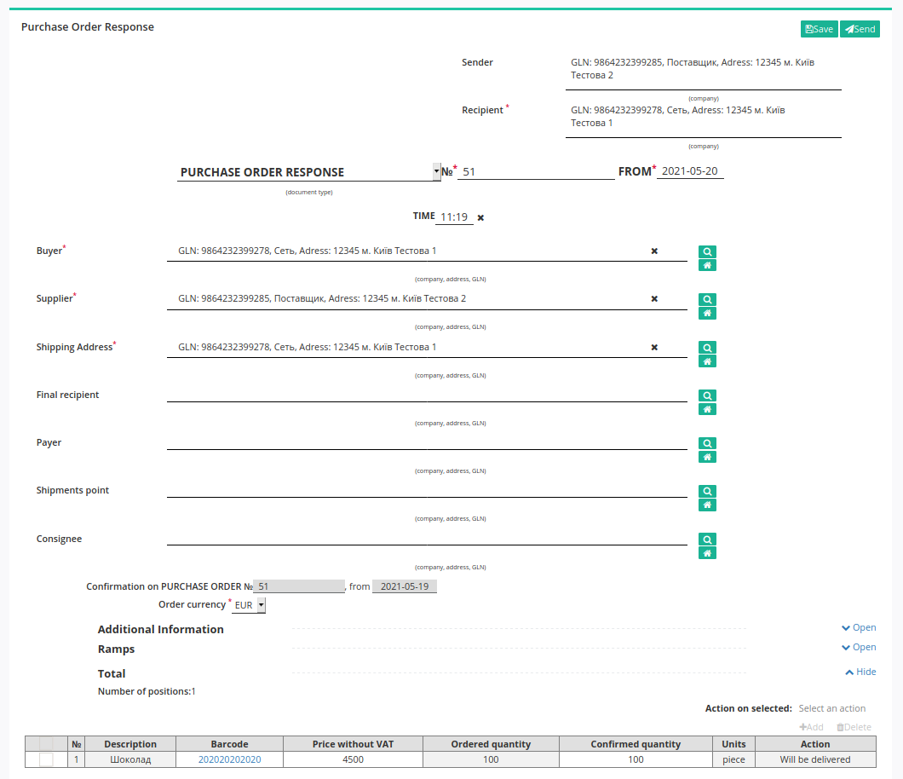

#. **Recipient** - recipient data (network); not editable;
#. **Purchase Order Response** - type selector field: *Purchase Order Response*, *Purchase Order Response replacement*, *Deleting a Purchase Order Response*;
#. **№** - Purchase Order Response number;
#. **from** - Purchase Order Response date, current date is specified by default;
#. **Buyer** - filled in automatically with the "Search for a counterparty" button (|loupe|) or with the "Specify yourself" button (|house|);
#. **Supplier** - filled in automatically with the "Search for a counterparty" button (|loupe|) or with the "Specify yourself" button (|house|);
#. **Shipping Address** - filled in automatically with the "Search for a counterparty" button (|loupe|) or with the "Specify yourself" button (|house|).

.. hint::
   It is possible to specify or change the Buyer or Supplier data by using the **"Search for a counterparty"** button (|loupe|) or using the **"Specify yourself"** button (|house|). Enter a company name, GLN, or TIN for searching:

   .. image:: pics_ATB_International_transportation_instruction/ATB_International_transportation_instruction_005.png
      :align: center

.. вирішили прибрати, але для інших інструкцій ок - Блоки **Додаткова інформація** та **Рампи** необов'язкові для заповнення і "згорнуті" за замовчуванням. Блок **Разом** розраховується автоматично після заповнення позицій.

   .. image:: pics_ATB_International_transportation_instruction/ATB_International_transportation_instruction_018.png
      :align: center

The tabular part displays the basic information on the ordered **product items**. **Items** are transferred from the Order: they can be added, changed, confirmed / rejected or deleted.

:red:`All changes with product positions are possible only after adjustment with the network!`

Once the items have been selected (checked), the following **"Action on selected"** are available over them: **Will be delivered** or **Denied**. In the **Actions** column of positions the status of the action is displayed. The following statuses are possible: **Will be delivered, Quantity changes**, or **Denied**.

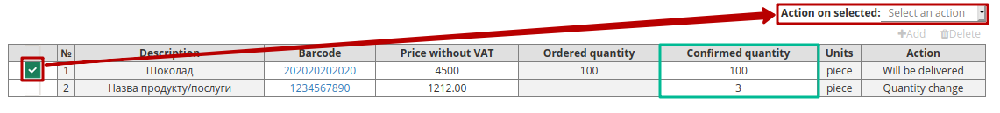
  
The Supplier can edit items, for example, when you need to change the quantity of a confirmed product. To do this, enter the quantity of the goods confirmed in the column **Confirmed quantity**. If there is no delivery for any of the items, it must be **"Deleted"**.

.. вирішили прибрати, але для інших інструкцій ок - Можливо також додати іншу позицію з Товарного довідника, заповнивши форму **Додати позицію** через кнопку **"+Додати"** (all required fields are marked with a red asterisk :red:`*`).

   .. image:: pics_ATB_International_transportation_instruction/ATB_International_transportation_instruction_020.png
      :align: center

.. attention::
   The confirmed number of product items can't exceed number of items specified in the "Purchase Order"!

After you insert all the data in the document, click **"Save"** (1), then **"Send"** (2).

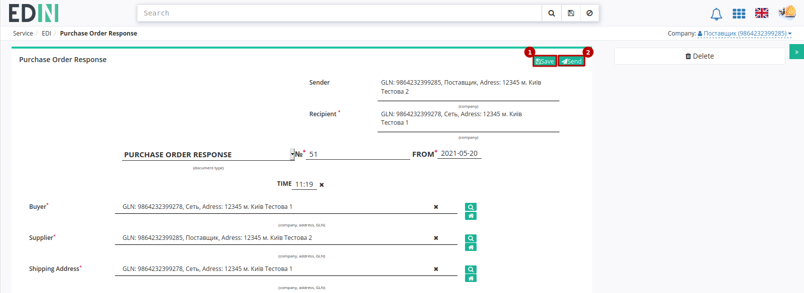

The sent document automatically gets to the **"Outbox"** folder and will be in the document chain together with the "Purchase Order". 

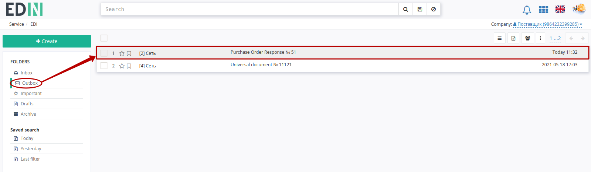

3 The "Despatch Advice" (DESADV) formation. The Supplier side 
=========================================================================================================================

To generate a "Despatch Advice" (DESADV), select "Purchase Order Response" (ORDRSP) in the **"Outbox"** folder. To search, simply enter the correct document number in the "Search" field. Documents can also be searched by **Sender**, **Document Date** and **Recipient**.

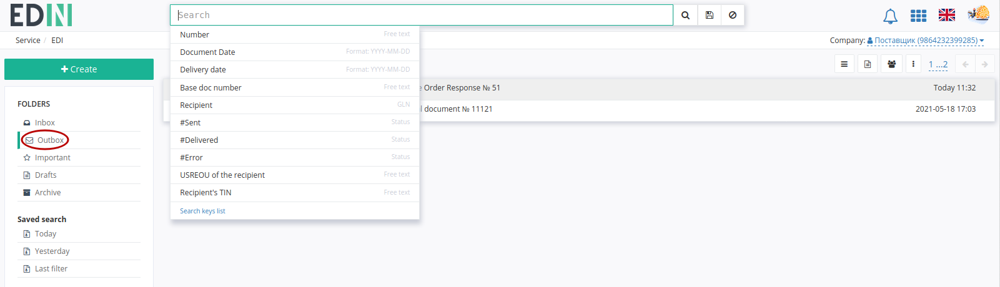

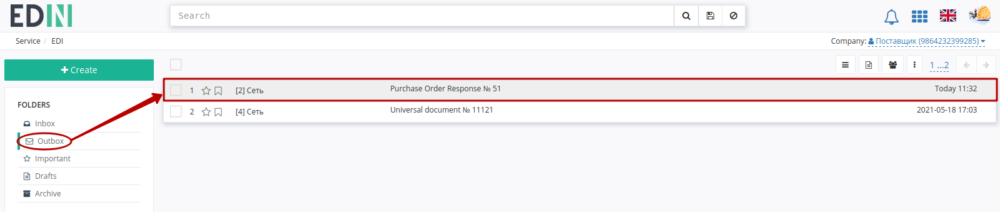

To create a "Despatch Advice" (DESADV), select the appropriate document on the hint form - the document will be created automatically.

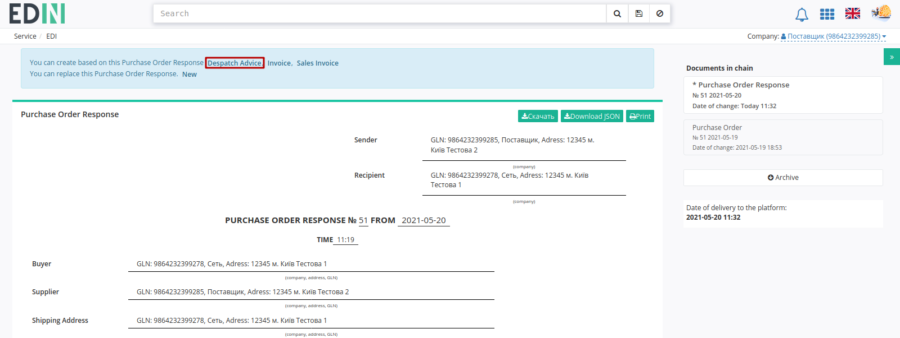

In the open form "Despatch Advice" (DESADV) some fields are filled in automatically from the associated base document (all required fields are marked with a red asterisk :red:`*`):

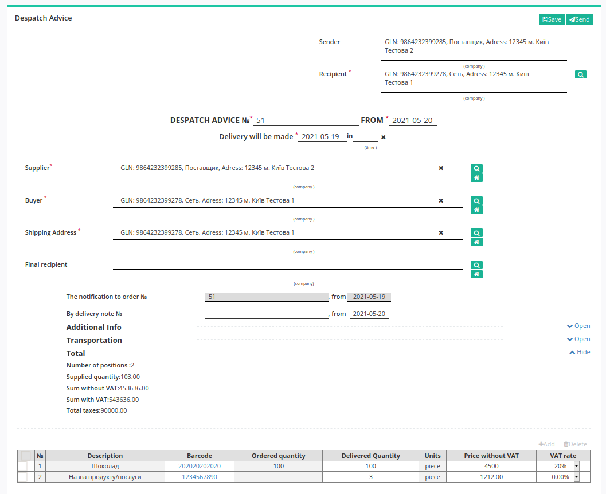

#. **Recipient** - Recipient data (network);
#. **Despatch Advice №** - "Despatch Advice" number;
#. **from** - "Despatch Advice" date, the current date is specified by default;
#. **Delivery will be made** - delivery date and time;
#. **Supplier** - filled in automatically with the "Search for a counterparty" button (|loupe|) or with the "Specify yourself" button (|house|);
#. **Buyer** - filled in automatically with the "Search for a counterparty" button (|loupe|) or with the "Specify yourself" button (|house|);
#. **Shipping Address** - filled in automatically with the "Search for a counterparty" button (|loupe|) or with the "Specify yourself" button (|house|);
#. **The notification to order №** - Order number in the document chain.

.. hint::
   It is possible to specify or change the Buyer or Supplier data by using the **"Search for a counterparty"** button (|loupe|) or using the **"Specify yourself"** button (|house|). Enter a company name, GLN, or TIN for searching:

   .. image:: pics_ATB_International_transportation_instruction/ATB_International_transportation_instruction_005.png
      :align: center

.. вирішили прибрати, але для інших інструкцій ок - Блоки **Додаткова інформація** та **Транспортування** необов'язкові для заповнення і "згорнуті" за замовчуванням. Блок **Разом** розраховується автоматично після заповнення позицій.

   .. image:: pics_ATB_International_transportation_instruction/ATB_International_transportation_instruction_026.png
      :align: center

.. important::
   **Attention!** The number of the specified consignment note must completely coincide with the number of the original paper invoice.

The list of product items (which were ordered) and their quantity must also match. The system automatically fills in the values for the items from the previously sent "Purchase Order Response" document, on the basis of which the "Despatch Advice" document (DESADV) was created. It is possible to make changes in the number and price of the positions.

:red:`All changes with product positions are possible only after adjustment with the network!`

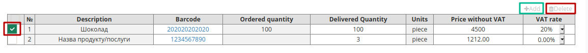

.. important::
   **Attention!** In case of creation of **several** sales invoices to order, it is necessary to generate **Despatch Advice** for each invoice. In this case, the field **"By delivery note №"** in the documents must be different. 

.. attention::
   The quantity of the delivered goods items cannot exceed the quantity specified in the "Purchase Order"!

If there is no delivery for any of the items, it must be **"Deleted"**.

.. вирішили прибрати, але для інших інструкцій ок - Можливо також додати іншу позицію з Товарного довідника, заповнивши форму **Додати позицію** через кнопку **"+Додати"** (all required fields are marked with a red asterisk :red:`*`).

After you insert all the data in the document, click **"Save"** (1), then **"Send"** (2).

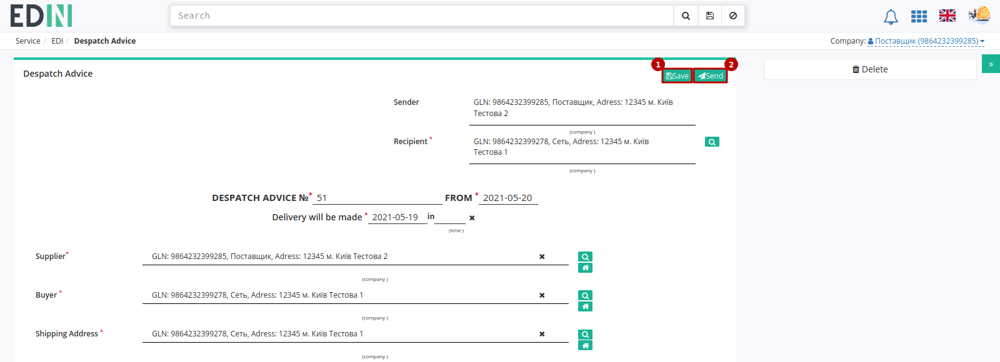
   
The sent document automatically gets to the **"Outbox"** folder and will be in the document chain together with "Purchase Order" and "Purchase Order Response". 

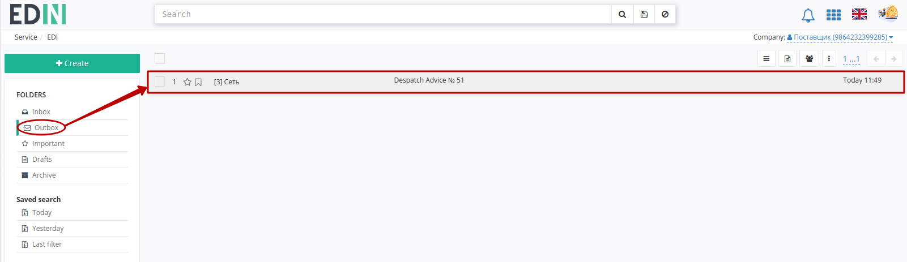

.. _condra-form:

4 The "Universal Document" (CONDRA) formation. The Supplier side 
=========================================================================================================================

To create a "Universal Document" (CONDRA) you need to select "Despatch Advice" (DESADV) in the **"Outbox"** folder. To search, simply enter the correct document number in the "Search" field. Documents can also be searched by **Sender**, **Document Date** and **Recipient**.

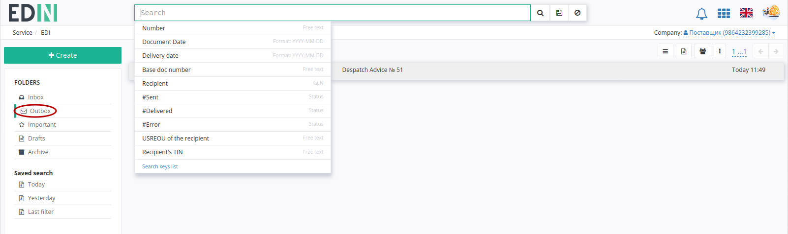

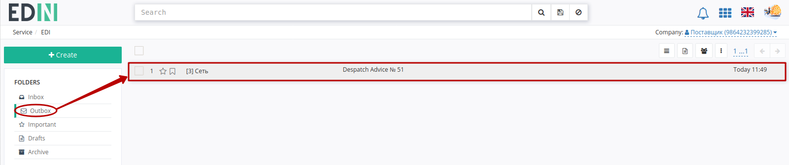

To create a "Universal Document" (CONDRA), select the appropriate document on the tooltip - the document will be created automatically. 

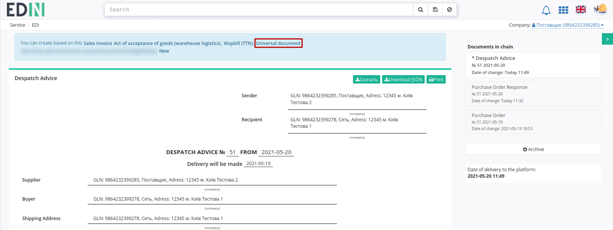

In the open form of the "Universal Document" (CONDRA) some fields are filled in automatically from the linked base document (all required fields are marked with a red asterisk :red:`*`):

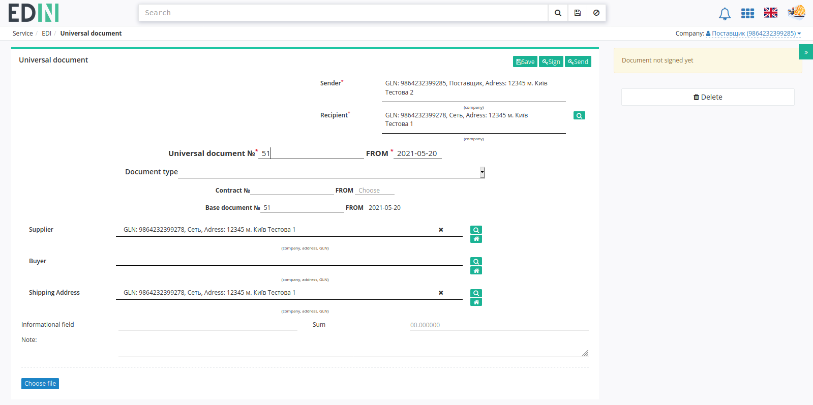

#. **Recipient** - Recipient data (network);
#. **Universal Document №** - "Universal Document" number;
#. **from** - "Universal Document", the current date is specified by default;

.. hint::
   It is possible to specify or change the Buyer or Supplier data by using the **"Search for a counterparty"** button (|loupe|) or using the **"Specify yourself"** button (|house|). Enter a company name, GLN, or TIN for searching:

   .. image:: pics_ATB_International_transportation_instruction/ATB_International_transportation_instruction_005.png
      :align: center

For convenience, specify the Document Type by selecting it from the list.

With the **"Choose file"** button it is possible to select and add a file (for example, a certificate) from your local storage:

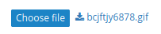

.. note::
   **Attention!** It is possible to add any file but only **1** and **up to 5 MB** in size! 

After selecting and downloading the file, the file name will be displayed next to the button in the form of a link where you can download the file for viewing.

After you insert all the data in the document, click **"Save"** (1), then **"Send"** (2) without signing. 

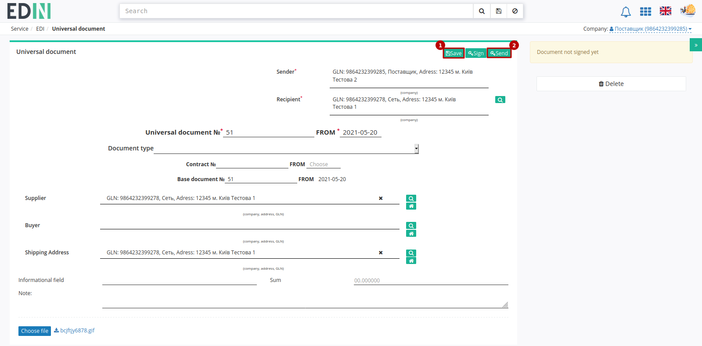
   
The sent document automatically gets to the **Outbox** folder and will be in the chain with the linked documents.

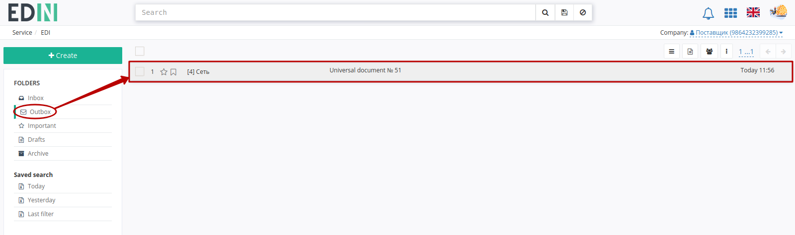

5 The "Universal Document" (CONDRA) formation. The "ATB" network side
=========================================================================================================================

If necessary, the ATB network can generate a "Universal Document" (CONDRA) in response, along with suggested changes and comments. 

.. hint::
   The process of a document forming has no differences and described in the `section above <https://wiki.edin.ua/en/latest/RetailersLists/ATB/ATB_Instructions/ATB_International_transportation_instruction.html#condra-form>`__ .

-------------------------------------

.. include:: /_static/files/kontakti.rst