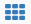
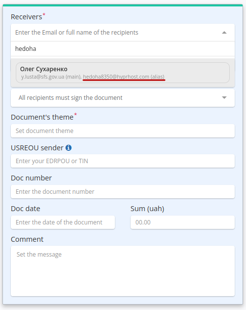
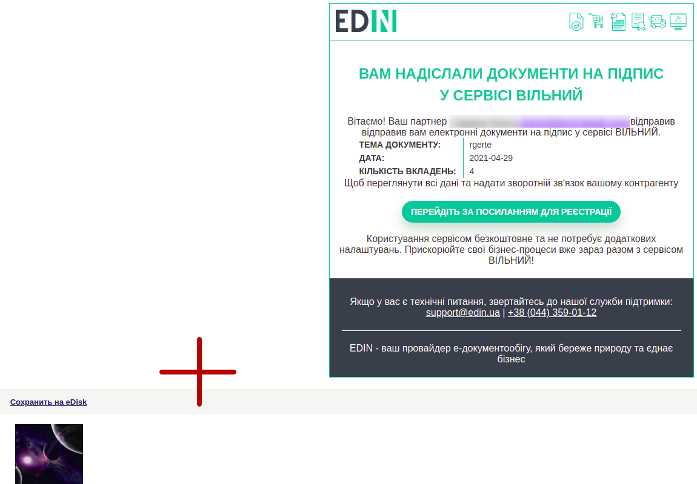

Work with "Vilnyi"
#############################################################

.. role:: red

.. role:: green

.. role:: orange

.. role:: olive

.. role:: navy

.. role:: underline

.. сюда закину немного картинок для текста

.. |звезда| image:: pics_Work_with_Vilnyi/Work_with_Vilnyi_06.png

.. |звезда2| image:: pics_Work_with_Vilnyi/Work_with_Vilnyi_07.png

.. |прокрутка1| image:: pics_Work_with_Vilnyi/Work_with_Vilnyi_12.png

.. |прокрутка2| image:: pics_Work_with_Vilnyi/Work_with_Vilnyi_11.png

.. |download| image:: pics_Work_with_Vilnyi/Work_with_Vilnyi_17.png

.. |trash| image:: pics_Work_with_Vilnyi/Work_with_Vilnyi_18.png

.. |print| image:: pics_Work_with_Vilnyi/Work_with_Vilnyi_52.png

.. |non| image:: pics_Work_with_Vilnyi/Work_with_Vilnyi_21.png

.. |лупа| image:: pics_Work_with_Vilnyi/Work_with_Vilnyi_49.png

.. |save| image:: pics_Work_with_Vilnyi/Work_with_Vilnyi_50.png

.. |green_tag| image:: pics_Work_with_Vilnyi/Work_with_Vilnyi_57.png

.. |trash2| image:: pics_Work_with_Vilnyi/Work_with_Vilnyi_81.png

.. |round| image:: pics_Work_with_Vilnyi/Work_with_Vilnyi_88.png

.. |denied| image:: pics_Work_with_Vilnyi/Work_with_Vilnyi_92.png

.. contents:: Contents:
   :depth: 3

---------

**1 Login to the platform**
================================================

.. include:: /general_2_0/rabota_s_platformoj_EDIN_2.0.rst
   :start-after: .. початок блоку для Enter
   :end-before: .. кінець блоку для Enter

After successful authorization, the main menu of EDIN products and solutions will open. In the **"Services"** tab you need to select the **"Vilnyi"** tile:

.. image:: /_constant/pics_landing/landing_vilnyi.png
   :align: center

.. hint::
   You can use the |пресуха| button or EDIN logo to return to the services menu.

**2 Service general view**
================================================

**"Vilnyi"** service contains `common functional elements of the platform <https://wiki.edin.ua/en/latest/general_2_0/rabota_s_platformoj_EDIN_2.0.html#header>`__ and among the main elements: own folders with documents (1) and a journal of documents (2) for viewing and working with documents. `Search <https://wiki.edin.ua/en/latest/Vilnyi/Work_with_Vilnyi.html#search>`__ and `Tags <https://wiki.edin.ua/en/latest/Vilnyi/Work_with_Vilnyi.html#tags>`__ functionality significantly simplify the work in the service.

There is an opportunity to switch to the folders of other employees and perform actions with documents on their behalf if the user is configured `access to service documents of other employees of the company <https://wiki.edin.ua/en/latest/Personal_Cabinet/PCInstruction.html#shard-entrance>`__ :

**3 Browse service folders**
================================================

The current location of the user in the service marked by a green line and a path is highlighted in a "breadcrumbs".

To go to the folder you need, you need to select it:

#. **"Inbox"** - folder of incoming documents of the organization (from contractors).
#. **"Outbox"** - folder of sent documents of the organization (to contractors).
#. **"Important"** - folder of all documents that have been marked as "important" with a star symbol ("important" |звезда| / |звезда2| "ordinary").
#. **"Drafts"** - folder for documents that were created but not sent yet. 
#. **"Archive"** - folder for documents that have been transferred to the archive.
#. **"Counterparties"** - allows you to find your unregistered counterparties and send them invitations by e-mail.

.. _doc-statuses:

**3.1 Document statuses**
-------------------------------------------------

**"Vilnyi"** service have the following statuses:

For **inbox** documents:

* :navy:`"Pending signature of the recipient"` - signed/unsigned document sent (Recipient has not signed the document yet);
* :navy:`"Pending acceptance of the recipient"` - signed/unsigned document sent (Recipient has not accepted the document yet);
* :olive:`"Signed"` - the incoming document was signed by the Recipient; may be the final status if the Sender has not signed the document;
* :olive:`"Accepted"` - the incoming document was accepted by the Recipient; may be the final status if the Sender has not signed the document;
* :green:`"Processed"` - final status of the document; sent document signed by the Sender, which was signed/accepted by all Recipients;
* :red:`"Rejected by recipient"` - final status of the document; sent signed/unsigned document was rejected by one of the counterparties (the document is considered rejected despite the actions of other counterparties);
* "Copy" - not available for editing "snapshot"-copy of the document (contains the status of the original and information about the signatures at the time of copying). No actions are available with the document (exclusion: Sender can `add Recipients <https://wiki.edin.ua/en/latest/Vilnyi/Work_with_Vilnyi.html#new-counterparty-add>`__ to a copy that has already been sent).

For **outbox** documents:

* :navy:`"Pending signature of the recipient"` - signed/unsigned document sent (none of Recipients has not signed the document yet);
* :navy:`"Pending acceptance of the recipient"` - signed/unsigned document sent (none of Recipients has not accepted the document yet);
* :orange:`"Partially signed by recipients"` - a signed / unsigned document was sent and some of the Recipients signed it;
* :orange:`"Partially accepted"` - a signed / unsigned document was sent and some of the Recipients accepted it;
* :olive:`"Signed"` - final status of the document; Sender sent an unsigned document which was signed by all Recipients;
* :olive:`"Accepted"` - final status of the document; Sender sent an unsigned document which was accepted by all Recipients;
* :green:`"Processed"` - final status of the document; sent document signed by the Sender, which was signed/accepted by all Recipients;
* :red:`"Rejected by recipient"` - final status of the document; sent signed / unsigned document was rejected by one of the counterparties (the document is considered rejected despite the actions of other counterparties);
* "Copy" - not available for editing "snapshot"-copy of the document (contains the status of the original and information about the signatures at the time of copying). No actions are available with the document (exclusion: Sender can `add Recipients <https://wiki.edin.ua/en/latest/Vilnyi/Work_with_Vilnyi.html#new-counterparty-add>`__ to a copy that has already been sent).

.. hint::
   Additionally, in the service folders, documents signed by the Sender have a green mark :green:`"Signed by the sender"`.

.. _create-and-send:

**4 Creating and sending a document**
================================================

To create a document on the platform you need to click on **"+Create"** button:

After that, on the form of creating a document you must specify "Receivers", "Document handle rule", "Document's theme" (from 1 to 100 characters) and add some attachments.

.. note::
   Fields "Doc number", "Doc date", "Sum (uah)", "Comment" are not required.

.. початок блоку для Repeat

.. warning::
   The fields "USREOU of the recipient" and "USREOU sender" are optional to be filled out. The fields can be filled in to form control of the correctness of signing documents according to USREOU. If the fields are filled in, the "Vilnyi" service will check You and Your counterparties at the stage of signing documents (the specified value of the USREOU and USREOU of the signatory QES key must match). If the value is incorrect (8,9,10,12 digits, a combination of 2 letters and 6 digits are allowed), You will not be able to sign/send the document, and if the value does not match, an error will occur during signing:

   .. image:: /Vilnyi/pics_Work_with_Vilnyi/Work_with_Vilnyi_140.png
      :align: center

.. кінець блоку для Repeat

.. _rules-for-recipients:

**4.1 Document handle rules**
-------------------------------------------------

The initiator of the document flow (Sender) configures the requirements for the completion of the document flow using the available **"Document handle rules"**:

* **All recipients must sign the document** - the document receives the final status "Signed" / "Processed" after all specified Counterparties-recipients sign the document;
* **One of the recipients must sign the document** - the document receives the final status "Signed" / "Processed" immediately after one of the Counterparties-recipients (the first one) signs the document;
* **All recipients must accept the document** - the document receives the final status "Accepted" / "Processed" after all specified Counterparties-recipients accept the document;
* **One of the recipients must accept the document** - the document receives the final status "Accepted" / "Processed" immediately after one of the Counterparties-recipients (the first one) accept the document.

.. _counterparty-add:

**4.2 Add recipients**
-------------------------------------------------

Recipients of the document are shown only the sending counterparty, but Recipients are shown the status of the document.

To choose the right **Recipients** (several possible) you need to start entering the name, mail or USREOU of the counterparty (min 3 characters) in the field and select from the list of registered users on the platform:

When entering an alias in the Mail Recipients field (read more about `alias settings <https://wiki.edin.ua/en/latest/Personal_Cabinet/PCInstruction.html#alias>`__) the name of the counterparty, his main email and the alias are displayed:

Implemented the ability to specify the Email of an unregistered user on the platform in the **"Receivers"** field. When adding such a user, select "Add Recipient" in the results of the drop-down list:

When sending a document, the sender receives a warning that requires confirmation:

If the recipient is not registered, an invitation is sent to the specified Email with a link to `registration <https://wiki.edin.ua/en/latest/general_2_0/User_registration.html>`__ and attached one (first) file without a signature:

Also :underline:`not registered recipient` get on Email reminders about invitations with list of senders and subject topics at next, 3rd, 6th, 12th and 27th days:

.. image:: pics_Work_with_Vilnyi/Work_with_Vilnyi_60.png
   :align: center

It is also possible to add registered / unregistered Recipients in bulk by copying (Ctrl+C) a list (values separated by commas, spaces or semicolons) of the required Email addresses and paste (Ctrl + V) them from the clipboard:  

.. _files-add:

**4.3 Adding files**
-------------------------------------------------

Files can be added from local media via the "Add File" or "Drag-and-drop" way:

.. note::
   One document can contain no more than 10 files in the following formats: PDF/JPG/JPEG/PNG/BMP/DOC/DOCX/XLS/XLSX/PPT/PPTX/CSV/TXT/XML/P7S (previews are available except for CSV and P7S) with a file size no more than 5 MB.

When adding more than 3 files, else files are hidden behind the scroll arrows (|прокрутка1| |прокрутка2|). A preview of their contents is available for the attached files:

When viewing an attached file, you can scale the file preview (1), use pagination (2), print a file (if it signed: layout with the signature visualization in the form of a watermark and a signature letter) (3) |print| (the button is active only for files in PDF/JPG/JPEG/PNG/BMP formats), download (4) |download| or delete (5) |trash| file.

.. note::
   Downloading (4) |download| format rules:

   * if the document is NOT signed, only the original file is downloaded;
   * if the document is signed, a zip archive (archive name = file name + Date + Creation time) is loaded; zip contains the original file and the signed file in p7s format;
   * if the document is signed and the file has PDF/JPG/JPEG/PNG/BMP extension, then zip archive (archive name = file name + Date + Creation time) is loaded; zip contains the original file, the signed file in p7s format and printed layout with visualization of the signature in the form of a watermark and a signature letter in pdf format (`more <https://wiki.edin.ua/en/latest/Vilnyi/Work_with_Vilnyi.html#signing-watermark>`__).

After adding the file (s) and filling in all required fields is possible **"Sign all"** files en masse and **"Send"** document ("Send the document without signing" also possible). With sending an unsigned document, a hint appears that requires confirmation of the action:

But **"Sign all"** files of the document is also possible after sending the document (if it was not rejected):

The Sender's signature is not mandatory, but this functionality allows you to implement document management schemes in which the Recipient is the first to sign.

.. _sign:

**4.4 Signing and sending the document**
-------------------------------------------------

.. include:: /Vilnyi/Work_with_Vilnyi.rst
   :start-after: .. початок блоку для Repeat
   :end-before: .. кінець блоку для Repeat

You can sign the document while viewing the document - **"Sign all"** button:

.. hint::
   Also in the **Drafts** folder is available `mass signing functionality <https://wiki.edin.ua/en/latest/Vilnyi/Work_with_Vilnyi.html#mass-sign>`__.

.. attention::
   With mass signing, only one signature is applied at a time. When adding/deleting files to/from the document, previously applied signatures will be deleted!

.. tabs::

   .. tab:: File key

      .. include:: /_constant/signing/signing.rst
         :start-after: .. початок блоку для Signing
         :end-before: .. кінець блоку для Signing

   .. tab:: Token

      .. include:: /_constant/token_signing/token_signing.rst
         :start-after: .. початок блоку для TokenSign
         :end-before: .. кінець блоку для TokenSign

   .. tab:: Дія.Підпис

      .. include:: /_constant/diya_signing/diya_signing.rst
         :start-after: .. початок блоку для DiyaPidps
         :end-before: .. кінець блоку для DiyaPidps

   .. tab:: Cloud

      .. include:: /_constant/cloud_signing/cloud_signing.rst
         :start-after: .. початок блоку для CloudSign
         :end-before: .. кінець блоку для CloudSign

.. _signing-watermark:

.. note::
   After signing files in PDF, JPG (JPEG), PNG, BMP formats, a watermark is added in the upper left corner of each page of the file when previewing them, and a signing letter page will be added:

   .. image:: pics_Work_with_Vilnyi/Work_with_Vilnyi_53.png
      :align: center
   
   The watermark contains information that the file was signed in the EDI Network, the GUID of the document and the current page of the file.

   .. image:: pics_Work_with_Vilnyi/Work_with_Vilnyi_54.png
      :align: center

   The signing letter contains a link and QR-code for downloading the document archive, information on the document and its signatories.

After signing the document, information about the signatories is displayed. To send documents you need to click on the **"Send"** button.

.. hint::
   Also in the **Drafts** folder is available `mass sending functionality <https://wiki.edin.ua/en/latest/Vilnyi/Work_with_Vilnyi.html#mass-send>`__.

If the Sender signs the document (after sending the document), all Recipients will be notified by Email:

.. image:: pics_Work_with_Vilnyi/Work_with_Vilnyi_110.png
   :align: center

After sending the document to the contractors, it is displayed in the journal of sent documents and has **Pending signature of the recipient** status (file and sign buttons are not active):

.. note::
   Sent documents have labels (with hints when hovering the cursor):

   * |yellow_tag| - "Partially delivered" (recipients include registered and unregistered users)
   * |green_tag| - "All docs are delivered" (all recipients are registered on the platform)
   * |red_tag| - "Waiting for receiver's registration" (all recipients are unregistered users)

When sending the document, a letter to the specified **"Recipient"** e-mail is sent also:

.. image:: pics_Work_with_Vilnyi/Work_with_Vilnyi_36n.png
   :align: center

.. _new-counterparty-add:

**5 Add recipients to the sent document**
===================================================================

.. attention::
   Only the Sender of the document has the opportunity to add new counterparties. Adding recipients to an already sent document is possible while the document (original) is in :navy:`"Pending signature of the recipient"` / :navy:`"Pending acceptance of the recipient"` / :orange:`"Partially signed"` / :orange:`"Partially accepted"` status (`more details about document statuses <https://wiki.edin.ua/en/latest/Vilnyi/Work_with_Vilnyi.html#doc-statuses>`__).

To add recipients to the sent document the sender must go to the document and press the **"+Add"** button:

Finding and adding a new recipient is similar to `creating a new document <https://wiki.edin.ua/en/latest/Vilnyi/Work_with_Vilnyi.html#counterparty-add>`__ (it is possible to add an unregistered participant):

The document is sent to new contractors with **"Send"** button.

.. _inbox-doc:

**6 Work with incoming documents**
================================================

All unread **"Inbox"** documents are displayed in bold:

When you go to the document, the data about the signatory is opened (if the Sender signed the document), the files are available for viewing and downloading (|download|). The following steps can be performed with the document: **"Decline all"** attached files or **"Sign"** / **"Accept"** them in response (according on the established `rules of processing <https://wiki.edin.ua/en/latest/Vilnyi/Work_with_Vilnyi.html#rules-for-recipients>`__ for this document):

.. include:: /Vilnyi/Work_with_Vilnyi.rst
   :start-after: .. початок блоку для Repeat
   :end-before: .. кінець блоку для Repeat

.. hint::
   The process of **Signing** of the document is typical and described in the `section above <https://wiki.edin.ua/en/latest/Vilnyi/Work_with_Vilnyi.html#sign>`__.

After acceptance / signing the document changes its status to :orange:`"Partially signed by recipients"` / :orange:`"Partially accepted"` / :olive:`"Signed"` / :olive:`"Accepted"` / :green:`"Processed"` depending on the established document handle rules, actions of Counterparties-Recipients (`more about document statuses <https://wiki.edin.ua/en/latest/Vilnyi/Work_with_Vilnyi.html#doc-statuses>`__).

With signing / accepting the document by the Recipient, a notification letter arrives at the sender's email, for example:

.. image:: pics_Work_with_Vilnyi/Work_with_Vilnyi_108.png
   :align: center

.. _rejection:

**6.1 Document rejection**
-------------------------------------------------

.. attention::
   Only incoming documents can be rejected! It is possible to reject a document before it changes its status to the final one (`more about document statuses <https://wiki.edin.ua/en/latest/Vilnyi/Work_with_Vilnyi.html#doc-statuses>`__)! A rejected document changes its status to **"Rejected"** for all participants, after which it cannot be signed / accepted by any participant.

To reject all attachments, open the document and press **"Decline all"** button:

.. image:: pics_Work_with_Vilnyi/Work_with_Vilnyi_42.png
   :align: center

In case of rejection, it is necessary to indicate the reason for rejection and **"Send"**:

A rejected document changes its status to **"Rejected"**. The counterparty that performed the rejection is indicated under the status together with the reason for the rejection.

.. Відхилений документ можливо лише **"Переслати"** (кнопки відхилення файлів, приймання/підписання не активні):

When the document is rejected, a notification letter is sent to the Sender's email:

.. image:: pics_Work_with_Vilnyi/Work_with_Vilnyi_109.png
   :align: center

Document flow completed.

.. _forward-doc:

**7 Forward the document**
================================================

"Inbox" or "Outbox" documents can be **"Forwarded"**:

Finding and adding a new recipient is similar to `creating a new document <https://wiki.edin.ua/en/latest/Vilnyi/Work_with_Vilnyi.html#counterparty-add>`__ (it is possible to add an unregistered participant):

When forwarding, a "snapshot"-copy of the document with the "Unavailable copy" status is formed (contains the status of the original and information about the signatures at the time of making the copy):

No actions with the copy of the document are available (except the ability to download attachments).

.. _contractors:

**8 Counterparties (sending invitations)**
================================================

The section allows you to find your unregistered counterparties and send them invitations by e-mail. First you need to add counterparties to the journal - this can be done using the **"Create counterparty"** button, then **"Save"** journal data:

The functionality of mass downloading of e-mail addresses via xls-file, which should correspond to the template, has also been developed. To add data correctly, you must first download **"Template"** (1), focusing on which it will be possible to attach a list of your contractors without errors with a **"From Excel"** (2) button:

Data of contractors in the journal can be edited:

.. attention::
   If the Excel document contains fields with errors or content that does not match the template, then such fields are highlighted in yellow and a message is displayed about requirements to make edits (such fields can be deleted by clicking |trash2|):

   .. image:: pics_Work_with_Vilnyi/Work_with_Vilnyi_80.png
      :align: center

   Hint indicates in a line with error:

   .. image:: pics_Work_with_Vilnyi/Work_with_Vilnyi_82.png
      :align: center

   ⠀⠀⠀⠀⠀⠀⠀
   
   .. image:: pics_Work_with_Vilnyi/Work_with_Vilnyi_83.png
      :align: center

Once the contractors have successfully uploaded to the **"Vilnyi"** service it checks the entered addresses, whether they are registered in the service and sets "Registration status" (registered |зареєстрований| or unregistered |незареєстрований|):

Each of the unregistered counterparties |незареєстрований| can be **"Invited"** individually (by clicking on **"To invite"** the button in the counterparty line) or in bulk (by marking unregistered counterparties |незареєстрований| and sending **"Invitation"** to all at once):

An invitation is sent to unregistered counterparties by e-mail:

.. image:: pics_Work_with_Vilnyi/Work_with_Vilnyi_84.png
   :align: center

When sending the invitation, the date of its sending is marked with the "Sent" status:

When the invited user has registered, a mark of the registered user will appear in the invitation field:

.. _mass-operations:

**9 Mass operations**
================================================

It is easy to download, sign, send, delete several documents at once in one click with the help of mass operations! When you start any mass operation in the lower right corner of the screen, a widget is launched that displays :navy:`process` and :green:`successful` / :red:`with mistakes` result of the tasks for each document / action separately:

The status is displayed next to the document / action name in the widget:

* |ring| - task in the processing;
* |success| - task completed successfully;
* |error| - task execution error.

And the icon at the beginning of the completed action will prompt you which process was performed:

The widget can be minimized or closed even while performing tasks. The widget can be restored by clicking on the process / error icon at the bottom of the screen (widget with all successfully completed tasks is not restored after closing):

.. _mass-download:

**9.1 Mass download of the documents**
-------------------------------------------------

**Mass documents downloading** is possible with the **"Download"** button:

.. image:: pics_Work_with_Vilnyi/Work_with_Vilnyi_44.png
   :align: center

Documents are downloaded as zip archives (archive name = first 10 characters of the document theme + Date + Creation time). Each of the archives contains directories (name = file name with extension) for each attachment. Each directory contains:

* if the document is not signed: the original file;
* if the document is signed: the original file and the signed file in p7s format.

.. note::
   If the signed document contains a file in the PDF/JPG/JPEG/PNG/BMP format, then the downloaded zip-archive for each such file additionally contains a printed layout with a visualization of the signature in the form of a watermark and a signature letter in pdf format (`more <https://wiki.edin.ua/en/latest/Vilnyi/Work_with_Vilnyi.html#signing-watermark>`__).

.. _reestr:

**9.2 Creating and downloading a registry of the documents**
---------------------------------------------------------

Consolidated downloading of data from selected sent documents of the catalog (not more than 100 documents) is provided for accounting. To download, you need to mark the documents and press the **"Download registry"** button:

The registry is formed from selected documents into an xlsx-file with a name that is formed according to the template: *List_of_documents _FolderName_Date(YYYY-MM-DD)_time(hh-mm-ss)*, for example: List_of_documents_Inbox_2021-06-30_12-47-31.xlsx. The following fields are entered in the registery: Recipient (for "Outbox"/"Important"), Sender (for "Inbox"/"Important"), Attachment file name, Document theme, Status, Submit date, Status change date, Document date, Document number, Document amount:

.. note::
   Reloading the page may interrupt the file formation process (the registry file is not saved)! If an error occurs in the upper right corner of the screen, the message "Error creating the registry" is displayed.

.. _mass-sign:

**9.3 Mass signing of the documents**
---------------------------------------------------------

The mass signing functionality (maximum 100 documents) is available only in the **Drafts** folder. 

.. include:: /Vilnyi/Work_with_Vilnyi.rst
   :start-after: .. початок блоку для Repeat
   :end-before: .. кінець блоку для Repeat

For mass signing, you must first select all documents ready for signing (unsigned documents with attachments) using a convenient filter **"Ready to sign"** (1): 

Next, you need to mark the desired documents from the list in order to **"Sign"** (2) them:

.. attention::
   With mass signing, only one signature is applied at a time. When adding/deleting files to/from the document, previously applied signatures will be deleted!

.. hint::
   The process of **Signing** of the document is typical and described in the `section above <https://wiki.edin.ua/en/latest/Vilnyi/Work_with_Vilnyi.html#sign>`__.

.. _mass-send:

**9.4 Mass sending of the documents**
---------------------------------------------------------

The mass sending functionality (maximum 100 documents) is available only in the **Drafts** folder. For mass sending, you must first select all documents ready to be sent (documents with attachments filled in the fields "Recievers" and "Theme") using a convenient filter **"Ready to send"** (1): 

Next, you need to mark the desired documents from the list in order to **"Send"** (2) them:

.. _mass-pdf:

**9.5 Mass upload of pdf-files**
-------------------------------------------------

In the **Drafts** directory it is possible to upload pdf-files en masse using the **"Upload PDF"** button. After clicking the button in the popup window, the rules for uploading are specified: 

To select and upload pdf-files, you need to specify the folder where these files are located (button **"Select folder with files"**), then the upload process will be displayed:

The upload process can be interrupted by the button **"Stop the upload process"**. Each document has a upload status mark next to each document:

* |clock| - file in queue;
* |round| - file in the processing;
* |accepted| - file uploaded successfully;
* |denied| - file upload error (such file is accompanied by a detailed description of the cause of the error):

Once the upload process is complete, it is possible to read the result (if necessary, correct errors that may have occurred during the download) and **"Close"** download results window:

.. _tags:

**10 Tags**
================================================

It is possible to "bind" tags to service documents. Tags is some kind of your identifiers, which are displayed only to you. Tags make `search <https://wiki.edin.ua/en/latest/Vilnyi/Work_with_Vilnyi.html#search-by-tags>`__ of the document or group of documents much easier.

In order to **create a new tag** you need to click on the **"Tags"** button, then enter an *unique* name of the future tag (not more than 20 characters) in the pop-up window and click on the **"Create "** button:

The last 10 created tags are displayed when you press the **"Tags"** button again (other tags can be searched by name):

To add / remove tag (s) you need to select the document (s), click on the **"Tags"** button, check / uncheck accordingly and click on the **"Apply"** button:

Tags are displayed in the document journal:

.. hint::
   If you select several documents in the pop-up **"Tags"** common and unique assigned tags will have different marks:

   .. image:: pics_Work_with_Vilnyi/Work_with_Vilnyi_117.png
      :align: center

The full list of tags is displayed when viewing the document:

When viewing the document there is a **"Tags"** button, which has a similar functionality for creating / editing / deleting tags, allows you to add tags to an open document:

Created Tags can be **Edited** |edit_tag| or **Deleted** |del_tag| with special buttons. When editing a tag name you need to **"Save"** changes - all documents that already had this tag will be updated automatically:

.. _search:

**11 Search and filter documents**
================================================

**11.1 Document search**
-------------------------------------------------

It is convenient to filter documents in the service with the help of **"Search"** functionality (all "Available search keys" can be viewed in one click):

.. image:: pics_Work_with_Vilnyi/Work_with_Vilnyi_23.png
   :align: center

You need to select / enter a parameter (several parameters are entered through a comma), the text if necessary and press |лупа|. Frequently used search queries are recommended to save to your own search (**"Saved search"** block):

Saved search applies only to a specific folder of the query: "Inbox" / "Outbox" / "Important" / "Drafts" / "Archive". By default, filters for Today's and Yesterday's documents are available in the **"Saved search"** block. 

.. note::
   The Sender/Recipient filter displays the document's name, email, and UUID during search and filtering, but when you save these filters and select them later, only the uuid is saved and displayed:

   .. image:: pics_Work_with_Vilnyi/Work_with_Vilnyi_138.png
      :align: center

You can delete a saved search using the cross icon. You can clear the "Search" line with the **"Reset filters"** |non| button. When you switch between the folders, the search bar is cleared. If the user has filtered a list of documents, then switched to viewing this document and back, the search is saved.

.. image:: pics_Work_with_Vilnyi/Work_with_Vilnyi_27.png
   :align: center

**11.2 Quick document filters**
-------------------------------------------------

The quick filter button is available for the "Inbox" and "Outbox" folders and is located in the upper right corner of the document journal:

For "Inbox":

* All - all incoming documents;
* Unread - documents that have not yet been viewed (opened);
* Read - documents that have already been viewed (opened).

For "Outbox":

* All - all sent (outgoing) documents;
* Delivered - documents, all Recipients of which received the document (marked |green_tag|);
* Error - documents with errors (Recipients will not receive them);
* Sent - sent (outgoing) documents awaiting Recipients' actions (in the status of "Pending"). 

.. hint::
   The filter value is duplicated in the search bar and saved during a given session for current folder.

.. _search-by-tags:

**11.3 Search by tags**
-------------------------------------------------

Due to functionality of `tags <https://wiki.edin.ua/en/latest/Vilnyi/Work_with_Vilnyi.html#tags>`__ is possible to create a personal system of "marking" documents, which will significantly speed up your personal search:

Tag search can be reset by clicking on the already selected tag or reset all filters. The "Tags" block displays 15 frequently used tags (the rest are available via the **"Show more"** button):

----------------------------
   
.. include:: /_constant/kontakti.rst
