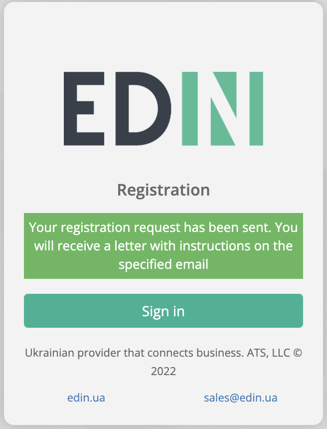

Registration and password recovery on the EDIN Network platform
###############################################################################

.. сюда закину немного картинок для текста

.. |del_key| image:: /_constant/signing/del_key.png

.. role:: red

.. role:: underline

.. contents:: Зміст:
   :depth: 3

---------

.. raw:: html

   

       <iframe src="https://www.youtube.com/embed/VXlC2CKPJwE" frameborder="0" allowfullscreen style="position: absolute; top: 0; left: 0; width: 100%; height: 100%;"></iframe>
   

---------

.. _auth:

**1 Authorization**
================================================

To start work with the **EDIN Network** platform, you need to log in (https://edo-v2.edin.ua/auth). Already registered users need to enter login (email) and password (set at `Registration <https://wiki.edin.ua/en/latest/general_2_0/User_registration.html#register>`__ or `Recovery/change password <https://wiki.edin.ua/en/latest/general_2_0/User_registration.html#pass-recovery>`__) and press **"Sign in"**:

.. _register:

**2 Registration**
================================================

User registration is the first step to gaining access to the EDIN Network platform. To register on the platform, click the **"Sign up"** button or follow the link https://edo-v2.edin.ua/register :

Fill in the following data:

* Email - in the future it will be used as a login for sign in 
* Password and password confirmation - enter your password, password must be at least 8 characters long.
* Agree to the offer and privacy policy - set the checkbox

To continue registration, click **"Sign up"**. An email will be sent to the specified email:

Wait for the email confirmation email.

.. attention::
   The letter could be spam. Therefore, check not only "Inbox", but also "Spam". In case of spam, set the rules so that subsequent emails from EDIN do not get spammed.

After receiving the letter, follow the link in it to confirm the email:

.. hint::
   After confirming the email, access to the `"Vilnyi" <https://wiki.edin.ua/uk/latest/Vilnyi/Work_with_Vilnyi.html>`__ service is opened. Thus, it is already possible to share free files / documents with your partners, customers, suppliers.

   .. image:: pics_User_registration/User_registration_011.png
      :align: center

.. note::
   You can go to a separate service for electronic document exchange – **"WhiteDoc"**. The service requires separate `registration <https://wiki.edin.ua/uk/latest/WhiteDoc/WD_Instructions/WD_registration.html>`__.

To access all other services and `personal cabinet <https://wiki.edin.ua/uk/latest/Personal_Cabinet/PCInstruction.html>`__ (private area) you need to create an account. To do this, click on the desired service and fill out the registration form.

Personal data forms can be entered using the Qualified Electronic Signature - tab **"For QES"** (available and recommended only for Ukrainian companies) and manually - tab **"By requisites"**:

.. _manual:

**2.1 Registration by requisites**
-----------------------------------------------------------------

When registering according to the details you need to fill in all required fields marked with a red asterisk :red:`*` (block "Mandatory information"):

The form must be filled in:

* **Company country** - used to verify the correctness of the entered data;
* **Registration number of the company or individual entrepreneur** - used for check correctly input, creation and verification of documents;
* **Company name or NPE** - used to display in documents;
* **Phone** - specify the contact phone number of the company that can be contacted to inform or resolve financial, commercial, technical issues;
* **Last name and first name** - indicate how you can be contacted.

.. note::
   Additionally, you can specify your GLN on the form, if you have one. If there is no GLN - the field is not filled in, the GLN will be created automatically (you can view all GLNs in the appropriate section of the personal account).

You can also provide additional information about the company on the form. This information is used to find your company by other platform customers. For European countries it is possible to specify the **EORI and VAT number**:

To complete the registration you need to click **"Finish registration"**:

The registered user becomes the owner of the account and is given maximum authority to manage the account.

.. _kep:

**2.2 Registration by QES**
-----------------------------------------------------------------

.. important::
   Only Ukrainian companies can register using QES (Qualified Electronic Signature).

In order to enter data using the QES you need to **"Choose"** a key:

.. include:: /_constant/signing/signing.rst
   :start-after: .. початок блоку для Signing
   :end-before: .. кінець блоку для Signing

When the key is successfully read on the registration form, the fields "EDRPOU or TIN" and "Company name or full name" are automatically filled in with data from the key without the possibility of editing them:

When registering using QES you need to fill in all required fields marked with a red asterisk :red:`*`:

The form must be filled in:

* **Company country** - used to verify the correctness of the entered data;
* **Registration number of the company or individual entrepreneur** - used for check correctly input, creation and verification of documents;
* **Company name or NPE** - used to display in documents;
* **Phone** - specify the contact phone number of the company that can be contacted to inform or resolve financial, commercial, technical issues;
* **Last name and first name** - indicate how you can be contacted.

.. note::
   Additionally, you can specify your GLN on the form, if you have one. If there is no GLN - the field is not filled in, the GLN will be created automatically (you can view all GLNs in the appropriate section of the personal account).

You can also provide additional information about the company on the form. This information is used to find your company by other platform customers. For European countries it is possible to specify the **EORI and VAT number**:

To complete the registration you need to click **"Finish registration"**:

The registered user becomes the owner of the account and is given maximum authority to manage the account.

.. _join-request:

**2.3 Join an existing account*
-----------------------------------------------------------------

.. attention::
   The account holder will be sent a new user confirming letter to the account if the EDRPOU or TIN code specified at the registration stage is already registered on the platform:

Until the account holder confirms the connection, the registered user does not have access to services other than **"Vilnyi"**. 

.. hint::
   To reduce the waiting time, contact your administrator or contact EDIN technical support.

When the administrator of the company **"Add" or "Reject"** the registered user a notifying mail will be sent.

.. _pass-recovery:

**3 Recovery/change password**
======================================

In case you forgot your password, you can recover it. To recover your password, click on **"Forgot your password?"**:

Enter your email on the form and click **"Restore"**:

.. important::
   Password recovery is possible only for users who use email as a login. Please contact technical support if the login is different from the password recovery email!

A password recovery instruction will be sent to the specified email:

Get the letter and follow the link in it:

Enter a new password and confirm it:

It's possible to log in to the EDIN Network platform immediately.

------------------------------

.. include:: /_constant/kontakti.rst
