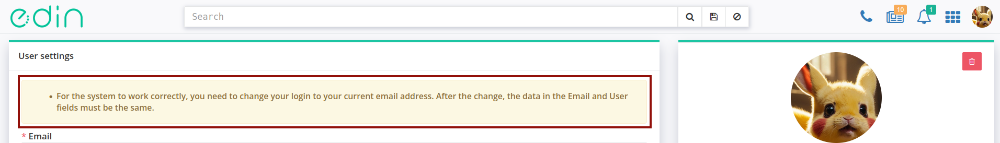

Work with "EDI Network" platform
#################################

.. сюда закину немного картинок для текста

.. |пресуха| image:: pics_rabota_s_platformoj_EDIN_2.0/rabota_s_platformoj_03n.png

.. |advserch| image:: pics_rabota_s_platformoj_EDIN_2.0/rabota_s_platformoj_009.png

.. |non| image:: pics_rabota_s_platformoj_EDIN_2.0/rabota_s_platformoj_011.png

.. |лупа| image:: pics_rabota_s_platformoj_EDIN_2.0/rabota_s_platformoj_010.png

.. |bell| image:: pics_rabota_s_platformoj_EDIN_2.0/rabota_s_platformoj_021.png

.. |bell2| image:: pics_rabota_s_platformoj_EDIN_2.0/rabota_s_platformoj_019.png

.. role:: red

.. role:: underline

.. contents:: Contents:
   :depth: 6

---------

**1 Login to the platform**
================================================

.. початок блоку для Enter

You can use any browser to work with the WEB service (**Google Chrome** latest version is recommended). To start work with the **EDIN Network** platform, you need to `Authorize <https://wiki.edin.ua/en/latest/general_2_0/User_registration.html#auth>`__ : follow the link https://edo-v2.edin.ua/auth, enter your user login and password, press **"Sign In"**, as shown in the image below:

.. image:: /general_2_0/pics_rabota_s_platformoj_EDIN_2.0/rabota_s_platformoj_072.png
   :align: center

.. hint::
   New users can easy go throught self- `"Register" <https://wiki.edin.ua/en/latest/general_2_0/User_registration.html#register>`__ on the "EDI Network" platform using Email. You can change your password, e-mail or other personal data in your `"User Profile" <https://wiki.edin.ua/en/latest/general_2_0/rabota_s_platformoj_EDIN_2.0.html#pers-settings>`__.

.. кінець блоку для Enter

.. _pers-settings:

**3 User profile**
================================================

Clicking on the user icon opens a menu with settings (account/company settings are described in the `instruction "Private aria" <https://wiki.edin.ua/en/latest/Personal_Cabinet/PCInstruction.html>`__):

Blocks are displayed in the user profile:

1. "User settings" - personal data of the user (Email, Surname, First/Last/Middle name, Phone number, Social Security number, Driver's license number). Mandatory fields are marked with a red star :red:`*`. The user can add/change information about himself.
2. "Select a profile photo" that will be displayed instead of the standard icon.
3. If necessary, it is always possible to change the password (at least 8 characters).
4. "List of user sessions" allows you to track all user sessions.
5. Ukrainian, English and German languages are available for selecting the interface language that will be displayed to this user.

Tips can also be displayed in the user profile in the User Settings block:

.. hint::
   For the correct operation of the system, the login for entering the platform must match your current email. For users who have a different login, the replacement functionality is provided:

When changing the user's email to the specified (new) email, you need to enter the password of the current user (confirmation of the action) - a letter to confirm the postal address will be sent to the new email.

.. to be continued