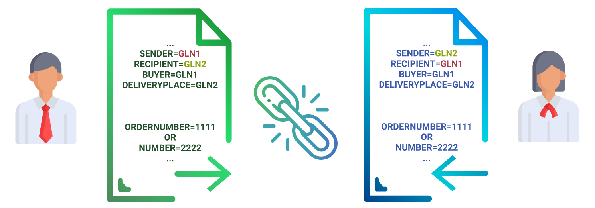

######################################################################
**Obtaining a chain of documents**
######################################################################

To work with this method, the user must be `authorized <https://wiki.edin.ua/en/latest/integration_2_0/APIv2/Methods/Authorization.html>`__ .

.. hint::
  Documents are linked in one chain, if they have identical values of the fields **"Sender"**, **"Recipient"**, **"Buyer"**, **"Delivery point"** (GLNs) and **"Order number"** (if not then **"Document number"**).

Using the method **api/eds/chain** and the specified parameters it is possible to obtain (download) the necessary data of the specified document chain. 

.. csv-table:: 
  :file: EdsChain.csv
  :widths:  10, 41
  :stub-columns: 0

**Examples of url-requests:**

Get a list of documents on a specific chain without downloading their bodies, packages, comments, tags and statuses
=======================================================================================================================

  https://edo-v2.edin.ua/api/eds/chain?gln=9864232304302&chain_uuid=0fe60377-51db-4b7a-b7eb-cdf5fa91a46a&load_docs=true&load_bodies=false&load_package=false&load_comments=false&load_tags=false&load_statuses=false

Get a list of documents on a specific chain with the bodies, comments downloading and without downloading their packages, tags and statuses
====================================================================================================================================================

  https://edo-v2.edin.ua/api/eds/chain?gln=9864232304302&chain_uuid=0fe60377-51db-4b7a-b7eb-cdf5fa91a46a&load_docs=true&load_bodies=true&load_package=false&load_comments=true&load_tags=false&load_statuses=false

Get a list of documents on a specific chain with the packages, tags downloading and without downloading their bodies, comments and statuses
====================================================================================================================================================

  https://edo-v2.edin.ua/api/eds/chain?gln=9864232304302&chain_uuid=0fe60377-51db-4b7a-b7eb-cdf5fa91a46a&load_docs=true&load_bodies=false&load_package=true&load_comments=false&load_tags=true&load_statuses=false

Get a list of documents on a specific chain with the statuses downloading and without downloading their bodies, comments, packages and tags
===============================================================================================================================================

  https://edo-v2.edin.ua/api/eds/chain?gln=9864232304302&chain_uuid=0fe60377-51db-4b7a-b7eb-cdf5fa91a46a&load_docs=true&load_bodies=false&load_package=false&load_comments=false&load_tags=false&load_statuses=true

**RESPONSE**

**Response** transmits chain of documents (object `XChain <https://wiki.edin.ua/en/latest/integration_2_0/APIv2/Methods/EveryBody/XChainPage.html>`__).

